#安卓UI控件总结

##布局Layout的设置

### LinearLayout 线性布局

```
    <LinearLayout
        android:id="@+id/linear_layout1"     【1. 控件ID】
        android:layout_width="match_parent"  【2. 指定组件的宽度】
        android:layout_height="match_parent" 【3.  指定组件的高度】
        android:orientation="center"     【4. Layout内使用的布局模式】
        【5.　gravity的中文意思就是”重心“，就是表示view本身的内容横向和纵向的停靠位置  】
       android:gravity="top|bottom|left|right|center_vertical|fill_vertical|center_horizontal|fill_horizontal|center|fill|clip_vertical|clip_horizontal|start|end" 
       android:visibility="visible"   【6. 视图是否可见】
       android:layout_weight="1"   【 7.用于指定剩余空闲空间的分割比例】
       android:layout_margin="10dp"  【8.距离相邻上下左右view的相对距离  】 
       android:padding="20dp"   【9. 控件内内容距离控件边界的距离】
       android:theme="@style/Animation.AppCompat.Dialog"  【10. 设置安卓主题样式规格】
       android:elevation="1dp"  【11.  elevation 值决定了阴影的大小和显示的顺序】
       android:addStatesFromChildren="true"  【12. 是否允许子控件的状态获取焦点等事件影响 自己这个控件】
       android:alpha="1.0"     【13. 透明度设置  Android:alpha="0.0" 看不见的    Android:alpha="0.5"透视    Android:alpha="1.0全可见 】
       android:animateLayoutChanges="true"   【14.布局变更动画过渡开关】
       android:background="@android:color/holo_green_dark"    【15. 控件背景】
       android:backgroundTint="@color/colorAccent"           【16. 设置了android:backgroundTint 将设置的颜色和原来的背景进行一个叠加】
       android:backgroundTintMode="src_over"   【17. 设置 android:backgroundTint 和 android:background 混合所使用的策略  】
       android:baselineAligned="true"   【18. 内容文字水平线是否对齐  默认为true】
       android:clickable="true"    【19. LinearLayout控件是否可点击】
       android:clipChildren="true"   【20. 是否限制子View在其范围内，我们将其值设置为false后那么当子控件的高度高于父控件时也会完全显示,而不会被压缩】
       android:clipToPadding="true"  【21. 是否对视图滑动时对应的padding进行裁剪 以保留 padding】  ▲
android:contentDescription="hell"   【22. 这个属性必须在用户的Accessible 中的相应属性开启后才能使用  对于一些视力有障碍的用户  android系统会自动使用人声朗读控件上android:contentDescription属性说指向的内容】
android:contextClickable="true"   【23.  设置是否对上下文响应点击事件 menu?  android:contextClickable="false" 】
android:descendantFocusability="beforeDescendants" 【24. 当一个为view获取焦点时，定义viewGroup和该子控件两者之间的 焦点事件获取的优先关系】▲
android:divider="#14b72f"     【25. 添加分割线 divider 】
android:dividerPadding="10dp"   【26. 添加分割线 divider 对应的内边距】
android:duplicateParentState="true"   【27. 如果希望点击父控件子控件也响应的话, 可以给子控件加如下属性】
android:fadeScrollbars="true"   【28. android:fadeScrollbars=”true”（默认参数）是在滑块不滚动时，隐藏   android:fadeScrollbars=”false”是在滑块不滚动时，不隐藏 】 
android:filterTouchesWhenObscured="true"  【29. 所在窗口被其它可见窗口遮住时,是否过滤触摸事件】
android:focusable="true"    【30. 控件是否可获得 焦点事件】
android:focusableInTouchMode="true"    【31. 是否在触摸模式下可响应 焦点事件   对于一个拥有触摸屏功能的设备而言, 一旦用户用手点击屏幕, 设备会立刻进入touch mode】
android:foreground="@drawable/ic_launcher_background"  【32. 设置点击效果时会用到  覆盖在原图上   例如点击效果渲染在ImageView上面】
android:hapticFeedbackEnabled="true"   【33. 事件是否会触发震动】
android:isScrollContainer="true"    【34. 是否是滚动条容器】
android:keepScreenOn="true"    【35. 视图在可见的情况下是否保持唤醒状态 】
android:layoutAnimation="@android:anim/fade_out"     【36. 布局动画 】
android:layoutDirection="ltr"    【37. 布局的显示方向】
android:layoutMode="clipBounds"    【38.布局模式?     android:layoutMode="clipBounds"    android:layoutMode="opticalBounds"   】
android:longClickable="true"     【39. 是否响应长按事件  android:longClickable="true"    android:longClickable="false" 】
android:minHeight="50dp"
android:minWidth="50dp"   【40.  最小高度  最小宽度】
android:nestedScrollingEnabled="true"   【41. 是否支持嵌套滚动】https://www.cnblogs.com/wjtaigwh/p/6398562.html
 
android:nextFocusUp="@+id/xxxx"  【42. 定义当点down键时，决定哪个控件将获得焦点  适用于电视安卓系统遥控 down什么的】
android:nextFocusDown="@+id/xxxx"
android:nextFocusLeft="@+id/xxxx"
android:nextFocusRight="@+id/xxxx"
android:nextFocusForward="@+id/xxxx"

android:onClick="@string/app_name"   【43. 属性设置点击时从上下文中调用指定的方法。该属性值和要调用的方法名称完全一致。一般在Activity定义符合如下参数和返回值的函数并将方法名字符串指定为该属性值即可】
android:outlineProvider="bounds"  【44. 设置View视图的阴影轮廓】
android:overScrollMode="always"   【45. 设置滑动模式】
android:persistentDrawingCache="animation|scrolling|all"   【46. 定义绘图的高速缓存的持久性 】
android:pointerIcon="wait"  【47. 设置鼠标滑过视图时  鼠标显示的样子   电视TV中有用】
android:requiresFadingEdge="horizontal|vertical"   【48. 设置垂直水平 边缘 显示阴影效果】


android:rotation="20dp" 
android:rotationX="10dp"
android:rotationY="10dp"   【49. 视图旋转的属性】
 
android:saveEnabled="true"  【50. 在配置改变等情况出现时是否保存view的状态数据。如果你的view有id，那默认系统就会帮你保存】 

android:scaleX="1"
android:scaleY="1"   【51. 视图View的缩放比例】
android:scrollIndicators="top|bottom|left|right|start|end" 【52. 显示视图滚动的位置】

android:scrollX="30dp"
android:scrollY="30dp"  【53. 当前滚动条滚动到的位置离 起点的距离  左右滚动条  上下滚动条】

android:scrollbars="none|horizontal|vertical"   【54. 不显示滚动条  显示左右滚动条  显示上下滚动条】

android:showDividers="beginning|middle|end"   【55. 显示分割线】

android:tag="@android:string/ok"   【56. tag属性   一般保存 的是 序列化的 object啊】
android:textAlignment="inherit"   【57.控件内 文本的排列方式】
android:textDirection="inherit"     【58. 文字的显示方式 上下显示 左右显示  后前显示】


android:transformPivotX="100dp"    【59.  视图的移动动画移动的偏移值】
android:transformPivotY="100dp"

android:translationX="50dp"  【59.  视图的移动动画移动的目的值】
android:translationY="50dp"
android:translationZ="50dp"

android:verticalScrollbarPosition="defaultPosition"   【60. 垂直滚动条 显示的位置  左边 右边(默认)】


>
</LinearLayout>

```
 **各个属性说明**
```
1.  android:id="@+id/linear_layout1"     【控件ID---定义控件ID】  R.id.linear_layout1
2.  android:layout_width=""  【指定组件的宽度】 可选值如下
     android:layout_width="wrap_content" 【依据控件内容决定】
     android:layout_width="match_parent" 【和父控件一样大小】
     android:layout_width="@android:dimen/app_icon_size"  【引用 指定 dimen尺寸的大小 】
     android:layout_width="100dp"  【直接使用dp指定大小】【dp（density-independent pixels 与密集度无关的像素）】dp=dip
     android:layout_width="100dip"  【直接使用dip指定大小】【device independent pixels 】 dip=dp
     android:layout_width="200px"    【直接指定使用px pixels(像素)  但由于每个设备像素密度不同 所以显示不同不同意 不推荐使用】
     
3.   android:layout_height=""  【指定组件的宽度】 可选值如下
     android:layout_height="wrap_content" 【依据控件内容决定】
     android:layout_height="match_parent" 【和父控件一样大小】
     android:layout_height="@android:dimen/app_icon_size"  【引用 指定 dimen尺寸的大小 】
     android:layout_height="100dp"  【直接使用dp指定大小】【dp（density-independent pixels 与密集度无关的像素）】dp=dip
     android:layout_height="100dip"  【直接使用dip指定大小】【device independent pixels 】 dip=dp
     android:layout_height="200px"    【直接指定使用px pixels(像素)  但由于每个设备像素密度不同 所以显示不同不同意 不推荐使用】
     
4.  android:orientation="" 【 LinearLayout里 内容使用的布局模式  为空则 默认排布为水平 horizontal排布 】 
    android:orientation="horizontal"   【 LinearLayout里内容水平排布 】
    android:orientation="vertical"      【 LinearLayout里内容垂直排布 】
   
   
5.  android:gravity="top|bottom|left|right|center_vertical|fill_vertical|center_horizontal|fill_horizontal|center|fill|clip_vertical|clip_horizontal|start|end" 
    【是对view控件本身来说的，是用来设置view本身的内容应该显示在view的什么位置，默认值是左侧。也可以用来设置布局中的控件位置 】 
    android:gravity="top"   // 内容靠近容器 顶部
    android:gravity="bottom"   // 内容靠近容器 底部
    android:gravity="left"   // 内容靠近容器 左边
    android:gravity="right"  // 内容靠近容器 右边
    android:gravity="center_vertical"   // 内容靠近容器 左中间
    android:gravity="fill_vertical" 
    android:gravity="center_horizontal"   // 内容靠近容器 顶部中间
    android:gravity="fill_horizontal" 
    android:gravity="center"    // 内容靠近容器 圆心  正中心位置
    android:gravity="fill" 
    android:gravity="clip_vertical" 
    android:gravity="clip_horizontal"

    
    android:gravity="start"      // 内容靠近容器起始点
    android:gravity="start|center_vertical"      // 内容靠近容器左边缘 中间位置
    android:gravity="start|bottom"      // 内容靠近容器左边缘底部位置
    
    android:gravity="center|top"      // 内容靠近容器顶部中间位置
    android:gravity="center"      // 内容靠近容器 圆心  正中心位置
    android:gravity="center|bottom"      // 内容靠近容器 圆心  正中心位置
    
    
    android:gravity="end"  // 内容靠近容器末尾
    android:gravity="end|center_vertical"  // 内容靠近容器右侧边缘中间点
    android:gravity="end|bottom"  // 内容靠近容器右下点
    
    
6.  android:visibility="visible"   【 视图是否可见选项】
    android:visibility="visible"    可见
    android:visibility="invisible"   不可见 但这个View在ViewGroupt中仍保留它的位置  隐藏
    android:visibility="gone"    不可见，这个View在ViewGroupt中不保留位置  销毁
    
    
7.  android:layout_weight="1"   【 7.用于指定剩余空闲空间的分割比例】
    
    用法:  【layout_weight=2 和 layout_weight=1  表示 第一个控件占据 2/3的空间  另一个控件 1/3的空间    】
<LinearLayout     
  android:orientation="horizontal">

  <TextView 
      android:layout_width="wrap_content"
      android:layout_height="wrap_height"
      android:layout_weight="1"   【layout_weight=1 和 layout_weight=1  表示 各占据一半的空间 】
      android:text="888"/>

  <TextView 
      android:layout_width="wrap_content"
      android:layout_height="wrap_height"
      android:layout_weight="1"
      android:text="999999"/>

</LinearLayout>

```
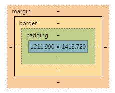  Margin Pading 的图示说明
```
8. android:layout_margin="10dp"  【距离相邻上下左右view的相对距离  】 

android:layout_marginTop="20dp"    【距离上面相邻视图 距离 20dp】
android:layout_marginBottom="30dp" 【距离下面相邻视图 距离 30dp】
android:layout_marginLeft="40dp"   【距离左面相邻视图 距离 40dp】
android:layout_marginRight="50dp"  【距离右面相邻视图 距离 50dp】
android:layout_marginEnd="20dp"    【距离末尾视图 距离 20dp】
android:layout_marginStart="60dp"  【距离视图开始 距离 60dp】


9. android:padding="20dp"   【 控件内内容距离控件边界的距离】

android:paddingTop="20dp"    【距离上边界 距离 20dp】
android:paddingBottom="30dp" 【距离下边界 距离 30dp】
android:paddingLeft="40dp"   【距离左边界 距离 40dp】
android:paddingRight="50dp"  【距离右边界 距离 50dp】
android:paddingEnd="20dp"    【距离末尾边界 距离 20dp】
android:paddingStart="60dp"  【距离起始边界 距离 60dp】
```


```
10. android:theme="@style/Animation.AppCompat.Dialog"  【 设置安卓主题样式规格】

    android:theme="@style/AlertDialog.AppCompat.Light"    【Project下的样式】
    android:theme="@android:style/Animation.Dialog"       【 Android下的样式 】
    android:theme="?attr/actionBarTheme"                  【 theme attributes 下的样式】
    
    
```


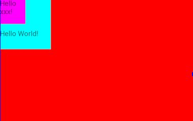 **有android:elevation显示的布局 ** 
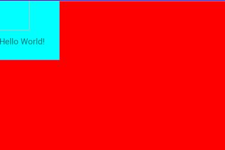 **没有android:elevation显示的布局  **
 
```
11. android:elevation="1dp"  【  elevation 值决定了阴影的大小和顺序】 【说明文档 https://www.jianshu.com/p/c1d17a39bc09】
    android:elevation="2dp"
    android:elevation="3dp"   ..... 在 Realtivited


例子:
    <RelativeLayout
        android:layout_width="match_parent"
        android:layout_height="300dp"
        android:background="#ff0000"
        >

        <TextView
            android:layout_width="50dp"
            android:layout_height="50dp"
            android:background="#FF00FF"
            android:elevation="2dp"     【有没有该属性的作用见上图】
            android:text="Hello xxx!" />

        <TextView
            android:layout_width="100dp"
            android:layout_height="100dp"
            android:paddingTop="30dp"
            android:background="#00FFFF"
            android:text="Hello World!" />
        
    </RelativeLayout>
```


```
12.  android:addStatesFromChildren="true"  【是否允许子控件的状态获取焦点等事件影响 自己这个控件】
android:addStatesFromChildren="true"    // 子控件的焦点事件  父控件也能接收
android:addStatesFromChildren="false" // 子控件的焦点事件  父控件不能接收

比方要实现一个LinearLayout中包括一个TextView和一个EditText，在用户点的时候实现焦点的效果。
将android:addStatesFromChildren设为true，当组中的EditText或是Button获取焦点时，
将Layout的Background设置成对应EditText或的Button的Drawable ，这样看上去该linear中的view是一个总体


13.  android:alpha="1.0"     【   Android:alpha="0.0" 看不见的    Android:alpha="0.5"透视    Android:alpha="1.0全可见 】
        android:alpha="0.0"    【透明】
        android:alpha="0.5"   【半透明】
        android:alpha="1.0"   【不透明】
```


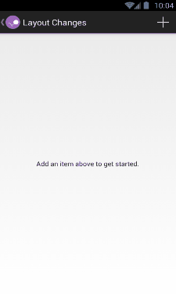 **布局变动会有动画过渡 可自定义过渡动画 **
```
14. android:animateLayoutChanges="true"   【布局变更动画过渡开关】  https://www.jianshu.com/p/59be431043c0

 android:animateLayoutChanges="true"   
 android:animateLayoutChanges="false"   


15.  android:background="@android:color/holo_green_dark"    【 控件背景 可以是颜色 #FFFFFF  也可以是资源drawable 】
 android:background="@android:color/holo_green_dark"   
 android:background="#FF00FF"
 android:background="@drawable/tupian"  【带有状态颜色切换的图片】


R.drawable.tupian
<selector xmlns:android="http://schemas.android.com/apk/res/android">
    <item android:state_pressed="false"android:drawable="@mipmap/start"/>
    <item android:state_pressed="true"android:drawable="@mipmap/start_down"/>
</selector>

```


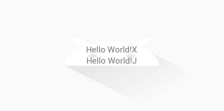 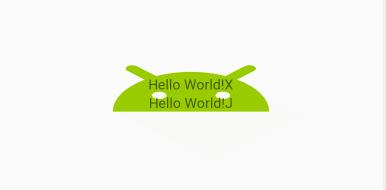
```

16. android:backgroundTint="@color/colorAccent"           【 设置了android:backgroundTint 将设置的颜色和原来的背景进行一个叠加】
android:backgroundTint="@android:drawable/btn_star_big_on"
android:backgroundTint="@android:color/holo_green_light"


17.  android:backgroundTintMode="src_over"   【设置 android:backgroundTint 和 android:background 混合所使用的策略  】

android:backgroundTintMode="src_over"  
android:backgroundTintMode="src_in"
android:backgroundTintMode="src_atop"
android:backgroundTintMode="multiply"
android:backgroundTintMode="screen"
android:backgroundTintMode="add"


```

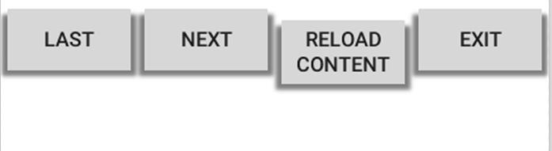   默认 android:baselineAligned="true"
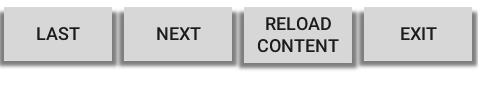 android:baselineAligned="false"
```
18.  android:baselineAligned="true"   【内容文字水平线是否对齐  默认为true】  https://blog.csdn.net/kayan19901/article/details/46332669
android:baselineAligned="true"
android:baselineAligned="false"

查看Android develper的LinearLayout的API会发现有一个属性：android:baselineAligned，这个属性默认是true，
所以LinearLayout里面的子View默认是baseline 对齐的，这就会导致第三个button第一行为了和其他button的text对齐下移 


19.  android:clickable="true"    【LinearLayout控件是否可点击】
 android:clickable="true"    控件可点击
 android:clickable="false"   控件不可点击   默认
 
 
 
 
```
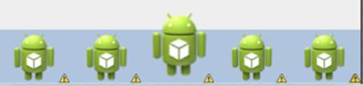
```
20. android:clipChildren="true"   【 是否限制子View在其范围内，我们将其值设置为false后那么当子控件的高度高于父控件时也会完全显示,而不会被压缩】https://blog.csdn.net/flymoon1201/article/details/44646473
android:clipChildren="true"    默认   限制子View在自身范围内
android:clipChildren="false"   解除限制子View在自身范围内的限制

```

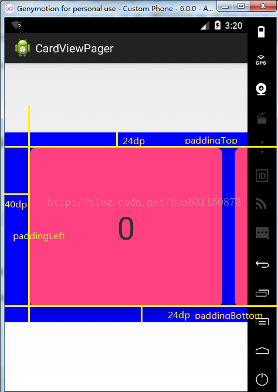    ** ListView 设置了 Padding**
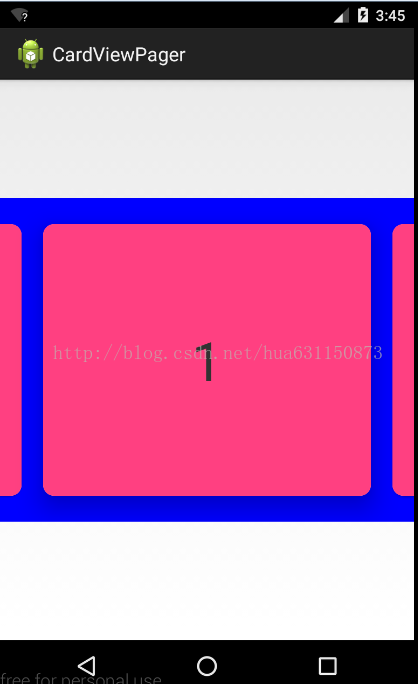 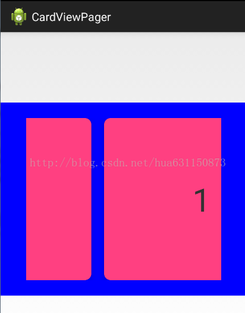  
** android:clipToPadding="fasle"时滑动的效果**              ** android:clipToPadding="true"时滑动的效果**
```
21.android:clipToPadding="true"  【 是否对视图滑动时对应的padding进行裁剪 以保留 padding】 https://blog.csdn.net/hua631150873/article/details/73648015

android:clipToPadding="true"     保留padding 
android:clipToPadding="fasle"   默认   不保留padding


22. android:contentDescription="hell"  
【 这个属性必须在用户的Accessible 中的相应属性开启后才能使用  对于一些视力有障碍的用户  android系统会自动使用人声朗读控件上android:contentDescription属性说指向的内容】


 android:contentDescription="@string/pause"
  android:contentDescription="hello world!"
  
  
  
  
24. android:descendantFocusability="beforeDescendants" 【 当一个为view获取焦点时，定义viewGroup和该子控件两者之间的 焦点事件获取的优先关系】
https://blog.csdn.net/android_gogogo/article/details/53376178
https://blog.csdn.net/okg0111/article/details/79886421


android:descendantFocusability="beforeDescendants"   【 beforeDescendants： viewgroup会优先其子类控件而获取到焦点】
android:descendantFocusability="afterDescendants"    【 afterDescendants：viewgroup只有当其子类控件不需要获取焦点时才获取焦点】
android:descendantFocusability="blocksDescendants"   【 blocksDescendants：viewgroup会覆盖子类控件而直接获得焦点 】


 项目中的listview不仅仅是简单的文字，常常需要自己定义listview，自己的Adapter去继承BaseAdapter，在adapter中按照需求进行编写，
 诸如ImageButton，Button，CheckBox等子控件(也可以说是Button或者Checkable的子类控件)此时这些子控件会将焦点获取到，所以常常当点击item时变化的是子控件，item本身的点击没有响应。   
 至于解法么，就是在item 里的RelativeLayout 加入android:descendantFocusability="beforeDescendants"
 
 
 
 


```

```
25.     【 添加分割线 divider】  https://blog.csdn.net/changsimeng/article/details/73278020   https://www.cnblogs.com/xianfeng-zhang/p/7987334.html
 
android:divider="@android:drawable/bottom_bar"   【drawable可以是图片文件，也可以是xml绘制的shape。】
android:divider="#14b72f" 
android:divider="@android:drawable/shape" 
 
 shape.xml
 <?xml version="1.0" encoding="utf-8"?>  
<shape xmlns:android="http://schemas.android.com/apk/res/android">  
    <solid android:color="@color/account_line" />  
    <size android:height="1px" />  
</shape>  


27. android:duplicateParentState="true"   【 如果希望点击父控件子控件也响应的话, 可以给子控件加如下属性】 https://blog.csdn.net/fancylovejava/article/details/38039847

android:duplicateParentState="true"   // 子控件响应父控件的事件  
android:duplicateParentState="false"    // 子控件不响应父控件的事件  


28.  android:fadeScrollbars="true"   【android:fadeScrollbars=”true”（默认参数）是在滑块不滚动时，隐藏   android:fadeScrollbars=”false”是在滑块不滚动时，不隐藏  】 

android:fadeScrollbars="true"    （默认参数）是在滑块不滚动时，隐藏 
android:fadeScrollbars="false"是在滑块不滚动时，不隐藏 


29.  android:filterTouchesWhenObscured="true"  【 所在窗口被其它可见窗口遮住时,是否过滤触摸事件】  https://www.jianshu.com/p/06574d8f10bf
android:filterTouchesWhenObscured="true"     // view所在窗口被其它可见窗口遮住时，是否过滤触摸事件  Android 视图只有在可见情况 下才能够与用户交互
android:filterTouchesWhenObscured="false" 


30. android:focusable="true"    【 控件是否可获得 焦点事件】
android:focusable="true" 
android:focusable="false" 


31. android:focusableInTouchMode="true"    【是否在触摸模式下可响应 焦点事件   对于一个拥有触摸屏功能的设备而言, 一旦用户用手点击屏幕, 设备会立刻进入touch mode】
android:focusableInTouchMode="true" 
android:focusableInTouchMode="false"       


Button（其isFocusableInTouchMode默认为false）, 当被点击的时候不会获取焦点，它们只是简单地执行onClick事件


```


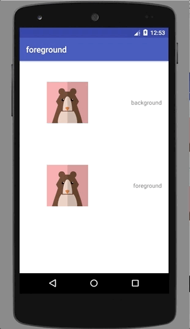 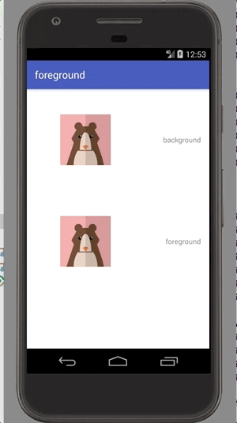 
```
32. android:foreground="@drawable/ic_launcher_background"  【 设置点击效果时会用到  覆盖在原图上   例如点击效果渲染在ImageView上面】

android:foreground="@drawable/ic_launcher_background" 
android:foreground="@drawable/middle_grey" 
android:foreground="#64f00757"   // 半透明


middle_grey.xml
<?xml version="1.0" encoding="utf-8"?>
<selector  xmlns:android="http://schemas.android.com/apk/res/android">
    <item android:state_pressed="false">
        <color android:color="@android:color/transparent"/>
    </item>
    <item android:state_pressed="true">
        <color android:color="@color/mid_grey"/>
    </item>
</selector>


34. android:isScrollContainer="true"    【 是否是滚动条容器】  https://blog.csdn.net/xinqing777/article/details/26000187

 android:isScrollContainer="true"   
 android:isScrollContainer="false"     // android:isScrollContainer属性的设置，对于键盘弹出时界面的显示效果是有影响的，当android:isScrollContainer=“false”  键盘会把HeadTitle 顶不见
 
 
 
 
35.android:keepScreenOn="true"    【 视图在可见的情况下是否保持唤醒状态 】

android:keepScreenOn="true"    
android:keepScreenOn="false"    
```

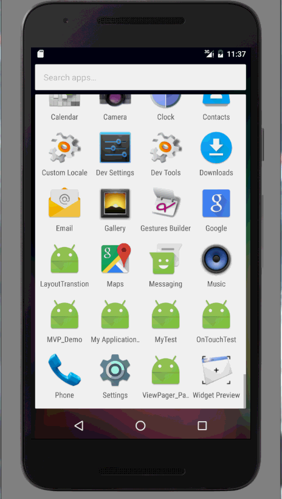
```
36.  android:layoutAnimation="@android:anim/fade_out"     【 布局动画 】   https://blog.csdn.net/lylodyf/article/details/52352697
android:layoutAnimation="@android:anim/fade_out" 
android:layoutAnimation="@android:anim/anim_home" 


anim/anim_home.xml

<?xml version="1.0" encoding="utf-8"?>  
<set xmlns:android="http://schemas.android.com/apk/res/android"  
    android:duration="500"  
    android:fillAfter="true">  
    <scale  
        android:fromXScale="0.3"  
        android:fromYScale="0.3"  
        android:pivotX="50%"  
        android:pivotY="50%"  
        android:toXScale="1.0"  
        android:toYScale="1.0" />  
    <alpha  
        android:fromAlpha="0.2"  
        android:toAlpha="1.0" />  
</set>  


37.android:layoutDirection="ltr"    【 布局的显示方向】

android:layoutDirection="ltr"     左到右正常排布   
android:layoutDirection="rtl"     右到左  阿拉伯国家~~
android:layoutDirection="inherit"
android:layoutDirection="locale"


```

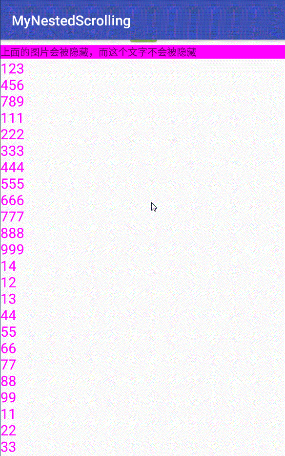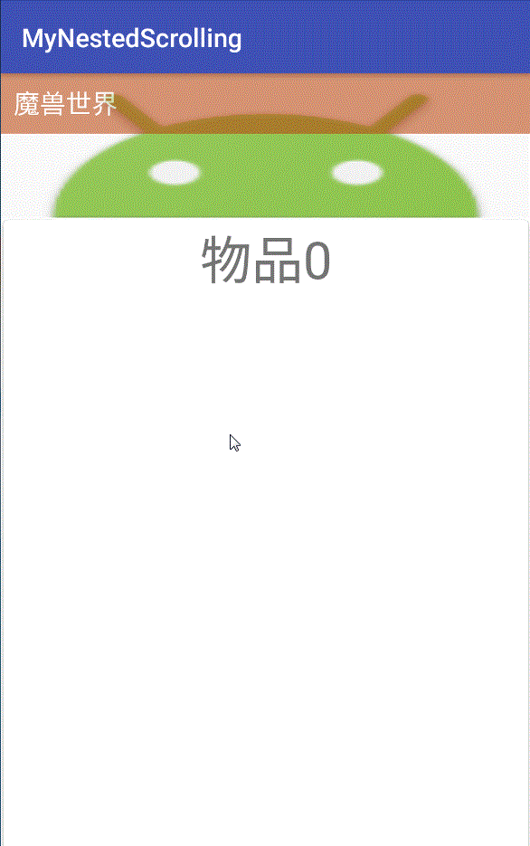
```
41. android:nestedScrollingEnabled="true"   【 是否支持嵌套滚动】https://www.cnblogs.com/wjtaigwh/p/6398562.html

android:nestedScrollingEnabled="true" 
android:nestedScrollingEnabled="false" 


43.  android:onClick="@string/methodName"  
【属性设置点击时从上下文中调用指定的方法。该属性值和要调用的方法名称完全一致。一般在Activity定义符合如下参数和返回值的函数并将方法名字符串指定为该属性值即可】

public void onClickButton(View view)
 
android:onClick="onClickButton"   对应Activity的相同方法名字


```

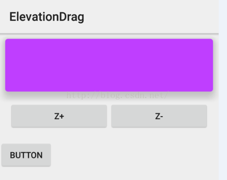
```
44. android:outlineProvider="bounds"  【 设置View视图的阴影轮廓】

android:outlineProvider="background"
android:outlineProvider="bounds"
android:outlineProvider="paddedBounds"


45. android:overScrollMode="always"   【 设置滑动模式】

android:overScrollMode="always"    【总是出现滑块】
android:overScrollMode="never"    【从不出现滑块】
android:overScrollMode="ifContentScrolls"  【如果内容超出 显示滑块】


<ListView        【 ListView 去掉滚动条 】
    android:id="@+id/lv_type"
    android:layout_width="match_parent"
    android:layout_height="match_parent"
    android:overScrollFooter="@android:color/transparent"
    android:overScrollHeader="@android:color/transparent"
    android:overScrollMode="never"
    android:scrollbars="none">
    
    
<android.support.v7.widget.RecyclerView     【 RecyclerView 去掉滚动条 】
    android:id="@+id/rv_search_one"
    android:layout_width="match_parent"
    android:layout_height="match_parent"
    android:overScrollMode="never"
    android:scrollbars="none" />
    
    
    
    
    
46. android:persistentDrawingCache="animation|scrolling|all"   【 定义绘图的高速缓存的持久性 】
android:persistentDrawingCache="animation"   
android:persistentDrawingCache="scrolling"
android:persistentDrawingCache="all"
android:persistentDrawingCache="animation|scrolling|all"

none	    0x0	The drawing cache is not persisted after use.
animation	0x1	The drawing cache is persisted after a layout animation.
scrolling	0x2	The drawing cache is persisted after a scroll.
all	        0x3	The drawing cache is always persisted.


47. android:pointerIcon="wait"  【 设置鼠标滑过视图时  鼠标显示的样子   电视TV中有用】
android:pointerIcon="arrow"
android:pointerIcon="context_menu"
 android:pointerIcon="hand"
  android:pointerIcon="help"
 android:pointerIcon="wait"
 android:pointerIcon="cell"
 
```

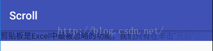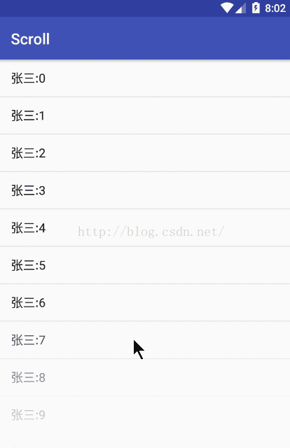
```

48.  android:requiresFadingEdge="horizontal|vertical"   【设置垂直水平 边缘 显示阴影效果】   https://blog.csdn.net/u012702547/article/details/52913538

android:requiresFadingEdge="horizontal"
android:requiresFadingEdge="vertical"
android:requiresFadingEdge="horizontal|vertical"


49.   android:rotation="20"  android:rotationX="10"  android:rotationY="10"  【视图旋转的属性】
android:rotation   关联方法: setRotation(float)    属性说明: 旋转度数

android:rotationX  关联方法: setRotationX(float)   属性说明: 水平旋转度数

android:rotationY  关联方法: setRotationY(float)   属性说明: 竖直旋转度数


51.   android:scaleX="1"   android:scaleY="1"   【 视图View的缩放比例】
1.0代表自身无变化，0.5代表起始时缩小一倍，2.0代表放大一倍


```

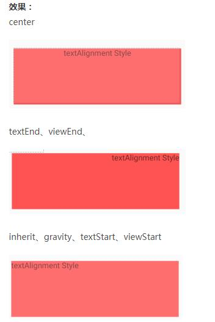
```
57. android:textAlignment="inherit"   【控件内 文本的排列方式】

android:textAlignment="inherit" 
android:textAlignment="gravity"
android:textAlignment="textStart"
android:textAlignment="textEnd"
android:textAlignment="center"
android:textAlignment="viewStart"
android:textAlignment="viewEnd"


58.  android:textDirection="inherit"     【文字的显示方式 上下显示 左右显示  后前显示】

android:textDirection="inherit" 
android:textDirection="firstStrong"
android:textDirection="anyRtl"
android:textDirection="ltr"
android:textDirection="rtl"
android:textDirection="locale"
android:textDirection="firstStrongLtr"
android:textDirection="firstStrongRtl"


60.  android:verticalScrollbarPosition="defaultPosition"   【 垂直滚动条 显示的位置  左边 右边(默认)】

android:verticalScrollbarPosition="defaultPosition"  
android:verticalScrollbarPosition="left"
android:verticalScrollbarPosition="right"
```


### RelativeLayout 线性布局
大部分属性与 LinearLayout 线性布局一直
RelativeLayout 包裹的 控件  含有属性

```
1.android:layout_above="@+id/t2"   【在RelativeLayout布局内  在控件id t2 上面的位置 】
2.android:layout_alignBaseline="@+id/t2"    【两个控件文本文字对齐  https://www.cnblogs.com/loulijun/archive/2012/10/17/2727580.html】
3.android:layout_alignBottom="@+id/t2"  
4.android:layout_alignEnd="@+id/t2"
5.android:layout_alignLeft="@+id/t2"
6.android:layout_alignParentBottom="true"
7.android:layout_alignParentEnd="true"
8.android:layout_alignParentLeft="true"
9.android:layout_alignParentRight="true"
10.android:layout_alignParentStart="true"
11.android:layout_alignParentTop="true"
12.android:layout_alignRight="@+id/t2"
13.android:layout_alignStart="@+id/t2"
14.android:layout_alignTop="@+id/t2"
15.android:layout_below="@+id/t2"
16.android:layout_centerHorizontal="true"
17.android:layout_centerInParent="true"
18.android:layout_centerVertical="true"
19.android:layout_toEndOf="@+id/t2"
20.android:layout_toLeftOf="@+id/t2"
21.android:layout_toRightOf="@+id/t2"
22.android:layout_toStartOf="@+id/t2"


1.android:layout_above="@+id/t2"   【在RelativeLayout布局内  在控件id t2 上面的位置 】
```

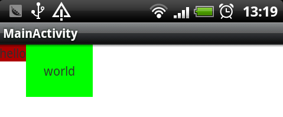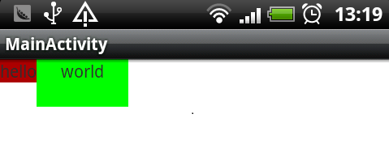
```
2. android:layout_alignBaseline="@+id/t2"    两个控件文本文字对齐  https://www.cnblogs.com/loulijun/archive/2012/10/17/2727580.html


3. android:layout_alignBottom="@+id/t2"  【在RelativeLayout布局内  与控件id t2 底面对齐 】
4. android:layout_alignEnd="@+id/t2"     【在RelativeLayout布局内  与控件id t2右边的位置 】
5. android:layout_alignLeft="@+id/t2"     【在RelativeLayout布局内 与控件id t2 左边的位置对齐 】
6. android:layout_alignParentBottom="true"    【在RelativeLayout布局内  在父控件的的底部 】
7. android:layout_alignParentEnd="true"   【在RelativeLayout布局内  在父控件的的最右边 】
8. android:layout_alignParentLeft="true" 【在RelativeLayout布局内  在父控件的的最左边 】
9. android:layout_alignParentRight="true" 【在RelativeLayout布局内  在父控件的的最右边 】
10 android:layout_alignParentStart="true"【在RelativeLayout布局内  在父控件的的最左边 】
11 android:layout_alignParentTop="true" 【在RelativeLayout布局内  在父控件的的顶部 】
12 android:layout_alignRight="@+id/t2"  【在RelativeLayout布局内 与控件id t2 右边对齐 】
13 android:layout_alignStart="@+id/t2"  【在RelativeLayout布局内 与控件id t2 左边对齐 】
14 android:layout_alignTop="@+id/t2"    【在RelativeLayout布局内 与控件id t2 顶部对齐 】
15 android:layout_below="@+id/t2"       【在RelativeLayout布局内 在控件id t2 的底部位置 】
16 android:layout_centerHorizontal="true"  【在RelativeLayout布局内 在父控件的水平中间位置 】
17 android:layout_centerInParent="true"    【在RelativeLayout布局内 在父控件的完全中间位置 】
18 android:layout_centerVertical="true"   【在RelativeLayout布局内 在父控件的垂直中间位置 】
19 android:layout_toEndOf="@+id/t2"    【在RelativeLayout布局内  在控件id t2 右边的位置 】
20 android:layout_toLeftOf="@+id/t2" 【在RelativeLayout布局内  在控件id t2 左边的位置 】
21 android:layout_toRightOf="@+id/t2"  【在RelativeLayout布局内  在控件id t2 右边的位置 】
22 android:layout_toStartOf="@+id/t2" 【在RelativeLayout布局内  在控件id t2 左边的位置 】

```


##TextView 的设置

### TextView 的属性

```
android:text="AAAA"     【 1.  textview 显示的字符串】
android:allowUndo="true"   【2. 允许撤销输入 适用于 edittext】
android:autoLink="web|email|phone|map|all"    【3. 当文本中包含 web phone email 之类的话  高亮显示连接】
android:bufferType="normal"    【4. 设置显示字符串的类型】
android:cursorVisible="true"   【5. 当前文字框光标可见】
android:digits="0123456789"   【6. 表示能够接受的字符集合。通过配置此属性，就可以实现只允许输入指定的字符 通常适用于 EditText 】

android:drawableBottom="@android:drawable/arrow_down_float"
android:drawableLeft="@android:drawable/btn_dialog"
android:drawableRight="@android:drawable/btn_star_big_on"
android:drawableTop="@android:drawable/button_onoff_indicator_on"
android:drawableEnd="@android:drawable/checkbox_on_background"
android:drawableStart="@android:drawable/btn_star"     【7. 在TextView的上下左右显示的提示图片】
android:elegantTextHeight="true"    【8. 优雅的文字高度，特别是对于不那么复杂的文字】
android:ellipsize="none"    【9. 文本超过布局空间时显示方式】
android:enabled="true"   【10. 使能可可用】
android:freezesText="true"   【11. 设置保存文本的内容以及光标的位置。】
android:height="100dp"     【12. 设置文本的高度】
android:hint="@string/app_name"    【13. 输入框 指定提示语 EditText适用于】

android:inputType="text|textCapCharacters|textCapWords|textCapSentences|textAutoCorrect|textAutoComplete|textMultiLine|
textImeMultiLine|textNoSuggestions|textUri|textEmailAddress|textEmailSubject|textShortMessage|textLongMessage|textPersonName|
textPostalAddress|textPassword|textVisiblePassword|textWebEditText|textFilter|textPhonetic|textWebEmailAddress|textWebPassword|
number|numberSigned|numberDecimal|numberPassword|phone|datetime|date|time"    【14. 适用于 EditText  输入类型  时间 日期 密码 邮件 数字 多层输入 等等....】
  
android:linksClickable="true"   【15. 文本中的连接是否可点击】
android:marqueeRepeatLimit="marquee_forever"   【16. 文本超出范围 跑马灯显示的次数   android:marqueeRepeatLimit="1"  】
android:maxLines="4"    【17. 当前文本框最大的行数】
android:textAlignment="inherit"   【18. 控件内文本的 排列方式】
android:textColor="@android:color/holo_blue_bright"   【19. 文本显示的颜色】
android:textColorHighlight="@android:color/holo_blue_light"   【20. 文本 高亮的颜色 】
android:textColorHint="@android:color/holo_green_light"    【21. 提示字符的颜色  适用于 Edittext】
android:textColorLink="@android:color/holo_red_light"     【22. 字符串连接显示的颜色】
android:textCursorDrawable="@null"   【23. 光标显示的颜色  @null 表示和文字颜色一样】
android:textIsSelectable="true"  【24. 文本是否可选中属性 】
android:textSize="36sp"    【25. 文字显示大小 sp 单位】
android:textStyle="bold|italic"    【26. 斜体  加粗】
 
```

```
1. android:text="AAAA"     【 textview 显示的字符串】
2. android:allowUndo="true"   【 允许撤销输入 适用于 edittext】
android:allowUndo="true" 
android:allowUndo="false" 

3. android:autoLink="web|email|phone|map|all"   【 当文本中包含 web phone email 之类的话  高亮显示连接】
android:autoLink="all" 
android:autoLink="web" 
android:autoLink="email" 
android:autoLink="phone" 
android:autoLink="map" 

4.android:bufferType="normal"    【 设置显示字符串的类型】

android:bufferType="normal" 
android:bufferType="spannable"
android:bufferType="editable"

normal     默认。
editable   类似于StringBuilder可追加字符，getText后可调用append方法设置文本内容。
spannable  则可在给定的字符区域使用样式


5. android:cursorVisible="true"   【当前文字框光标可见】
android:cursorVisible="true"
android:cursorVisible="false"


6. android:digits="0123456789"   【表示能够接受的字符集合。通过配置此属性，就可以实现只允许输入指定的字符 通常适用于 EditText 】
场景一：只允许输入数字 android:digits="0123456789"
场景二：只允许输入数字和英文字母 android:digits="0123456789abcdefghigklmnopqrstuvwxyzABCDEFGHIJKLMNOPQRSTUVWXYZ"
场景三：只允许输入数字，英文字母和@.两个符号 android:digits="0123456789abcdefghigklmnopqrstuvwxyzABCDEFGHIJKLMNOPQRSTUVWXYZ@."


```


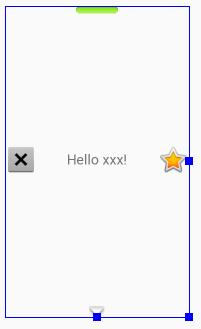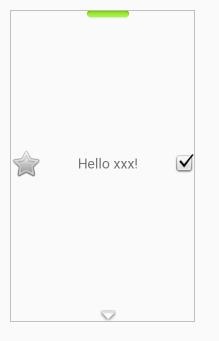
```
7.android:drawableStart="@android:drawable/btn_star"     【 在TextView的上下左右显示的提示图片】
android:drawableBottom="@android:drawable/arrow_down_float"
android:drawableLeft="@android:drawable/btn_dialog"
android:drawableRight="@android:drawable/btn_star_big_on"
android:drawableTop="@android:drawable/button_onoff_indicator_on"
android:drawableEnd="@android:drawable/checkbox_on_background"
android:drawableStart="@android:drawable/btn_star"   


8. android:elegantTextHeight="true"    【 优雅的文字高度，特别是对于不那么复杂的文字】
android:elegantTextHeight="true" 
android:elegantTextHeight="false" 


9. android:ellipsize="none"    【文本超过布局空间时显示方式】
android:ellipsize="none" 
android:ellipsize="start"
android:ellipsize="middle"
android:ellipsize="end"
android:ellipsize="marquee"

none     0没有省略号
start    1省略号显示在开头;
middle   2省略号显示在中间;
end      3省略号显示在结尾;
marquee  4以跑马灯的方式显示(动画横向移动)

```


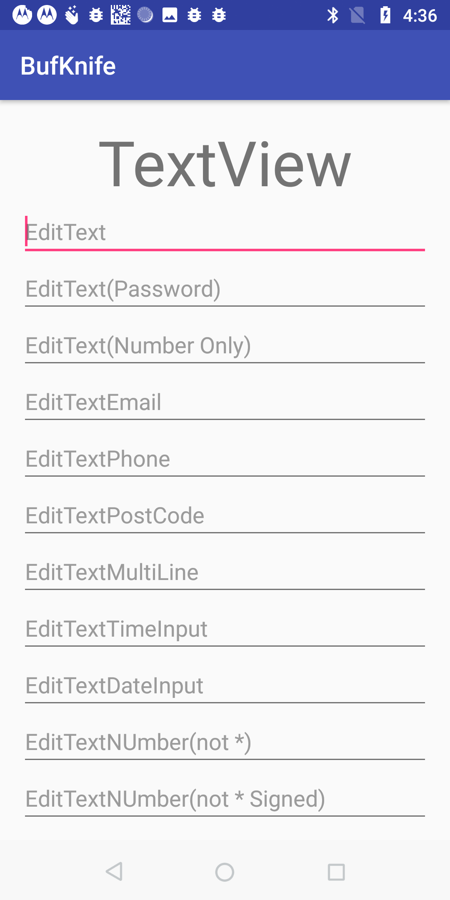
```
14. 
android:inputType="text|textCapCharacters|textCapWords|
  textCapSentences|textAutoCorrect|textAutoComplete|textMultiLine|
   textImeMultiLine|textNoSuggestions|textUri|textEmailAddress|textEmailSubject|
   textShortMessage|textLongMessage|textPersonName|textPostalAddress|textPassword|
   textVisiblePassword|textWebEditText|textFilter|textPhonetic|textWebEmailAddress|
   textWebPassword|number|numberSigned|numberDecimal|numberPassword|phone|datetime|date|time"    【适用于 EditText  输入类型  时间 日期 密码 邮件 数字 多层输入 等等....】
  
  
  
  
```
  
  

```
18. android:textAlignment="inherit"   【控件内 文本的排列方式】

android:textAlignment="inherit" 
android:textAlignment="gravity"
android:textAlignment="textStart"
android:textAlignment="textEnd"
android:textAlignment="center"
android:textAlignment="viewStart"
android:textAlignment="viewEnd"


19. android:textColor="@android:color/holo_blue_bright"   【 文本显示的颜色】
android:textColor="@android:color/holo_blue_bright"
android:textColor="@android:color/holo_green_dark" 
 
```

### EditText 的属性   大多数同 TextView的属性


##ListView的设置


##GridView的设置


##Fragment的设置


##RecyclerView 的设置