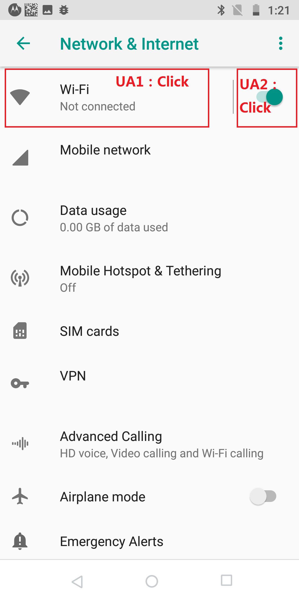
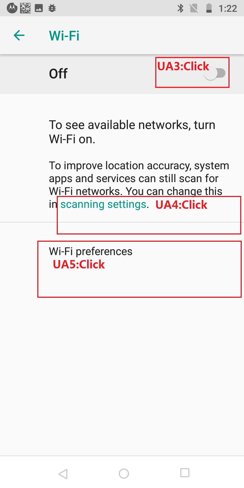
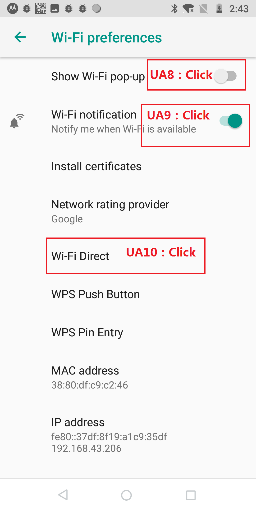
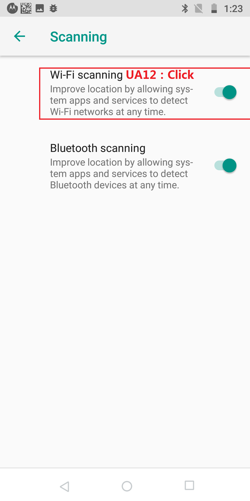
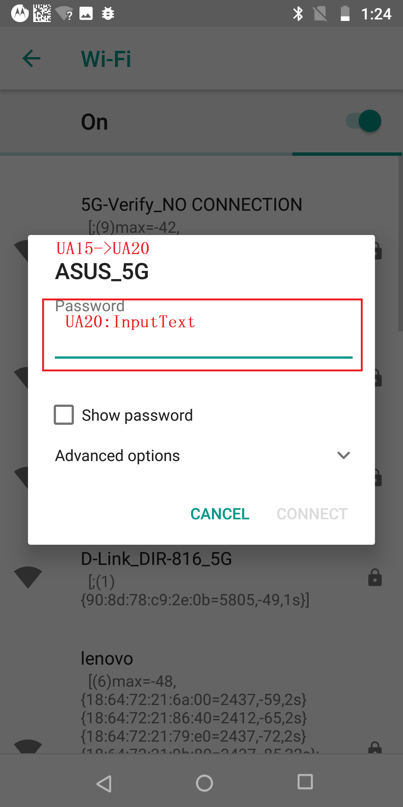
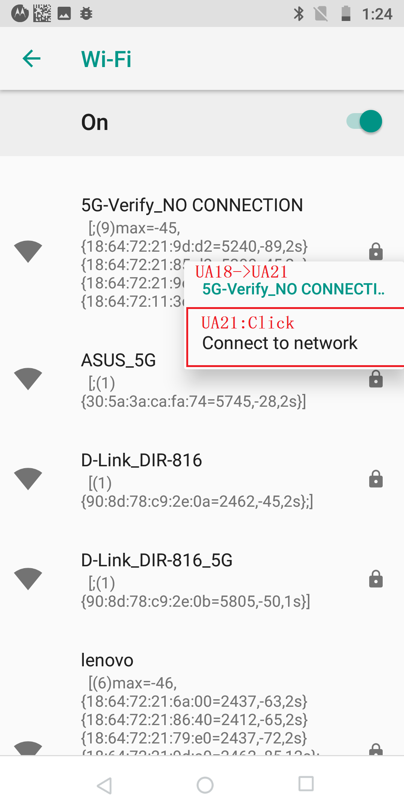
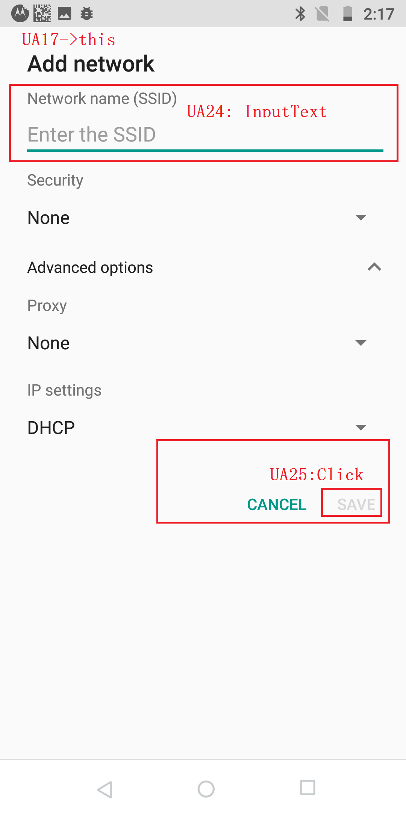
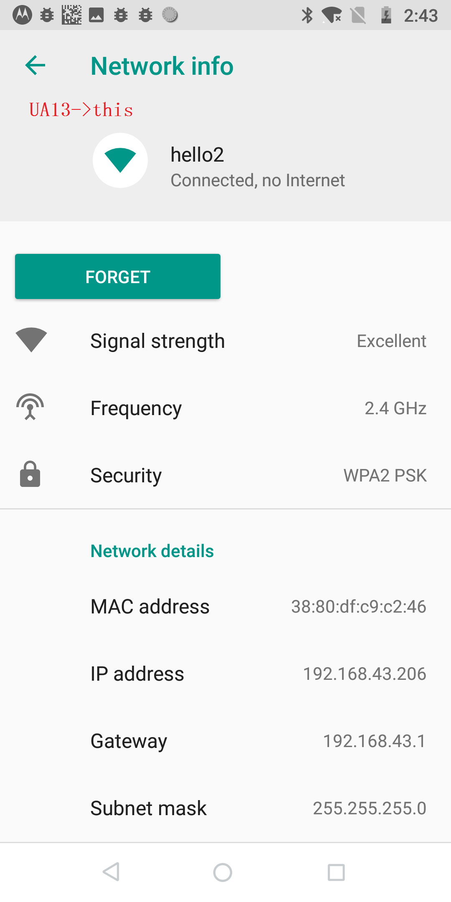
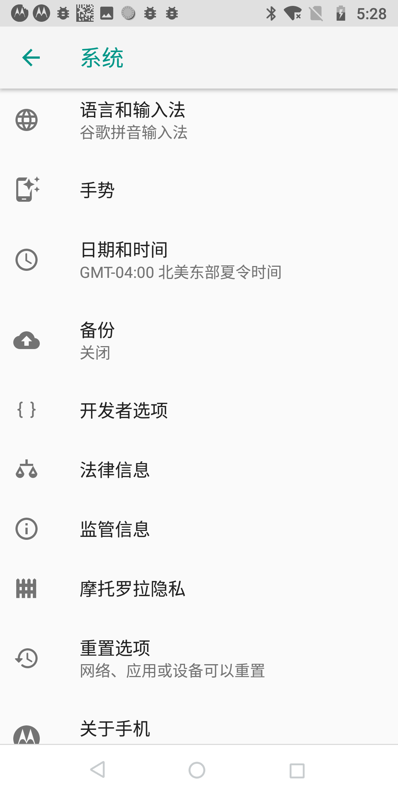

#WIFI的UI界面显示以及对应的UserAction(UA)

## WIFI UI界面以及对应的UA位置
       


       

       

       

       

       


## WIFI UA1分析
###WIFI UA1 操作列

1. **UA编号**   UA1
1. **UA说明**  ** WIFI设置界面入口**
1. **UA触发函数**  **在network_and_internet.xml布局文件的Preference指定了targetClass和Action的Intent** 在DashboardFeatureProviderImpl.java的openTileIntent函数
   activity.startActivityForResult(intent, 0) 函数被执行
1. **UA字符可选值**    Summary简要字符可选:     1.关闭 2.未连接 3.连接热点名字 
1. **UA布局及ID**     NetworkDashboardFragment的布局文件network_and_internet.xml中 android:key="toggle_wifi"
1. **代码Key**     
1. **代码可选值  **
1. **数据库Key ** 
1. **数据库可选值 ** 
1. **SP的Key**  
1. **SP可选值**  
1. **UA操作后UI显示类**  WifiSettingsActivity   (static) extends SettingsActivity
    ```<meta-data android:name="com.android.settings.FRAGMENT_CLASS" android:value="com.android.settings.wifi.WifiSettings" />```
1. **UA触发函数所在类**   NetworkDashboardActivity(static) extends SettingsActivity 依据[Manifest](file/AndroidManifest.xml)【加载 NetworkDashboardFragment 页面】
     ```<meta-data android:name="com.android.settings.FRAGMENT_CLASS"  android:value="com.android.settings.network.NetworkDashboardFragment"/>```
---


### WIFI-UA1代码分析
  
 
 [http://blog.sina.com.cn/s/blog_c5db74db0102wu0k.html](http://blog.sina.com.cn/s/blog_c5db74db0102wu0k.html)    为安卓8.0设置添加一级菜单的操作
 [https://blog.csdn.net/qq_31012033/article/details/79522813](https://blog.csdn.net/qq_31012033/article/details/79522813)  Android 8.0 Settings流程分析与变动
 
 
```
 /packages/apps/Settings/src/com/android/settings/core/gateway/SettingsGateway.java
public class SettingsGateway {

//该数组定义了设置界面所有的Activity以及对应显示Activity的顺序
public static final String[] SETTINGS_FOR_RESTRICTED = { 
// New IA
// Home page
Settings.NetworkDashboardActivity.class.getName(), // <string name="network_dashboard_title">"网络和互联网"</string>
Settings.ConnectedDeviceDashboardActivity.class.getName(), //<string name="connected_devices_dashboard_title">"已关联的设备"</string>
Settings.AppAndNotificationDashboardActivity.class.getName(),// <string name="app_and_notification_dashboard_title">"应用和通知"</string>
Settings.DisplaySettingsActivity.class.getName(),// <string name="display_settings_title">"显示"</string>
Settings.SoundSettingsActivity.class.getName(), //<string name="notification_channel_sound_title">"提示音"</string>
Settings.StorageDashboardActivity.class.getName(), //<string name="storage_settings">"存储"</string>
Settings.PowerUsageSummaryActivity.class.getName(), // <string name="power_usage_summary_title">"电池"</string>
Settings.UserAndAccountDashboardActivity.class.getName(),  // <string name="account_dashboard_title">"用户和帐号"</string>
Settings.SecuritySettingsActivity.class.getName(),  //  <string name="security_settings_title">"安全性与位置信息"</string>
Settings.AccessibilitySettingsActivity.class.getName(), // <string name="accessibility_settings">"无障碍"</string>
Settings.SystemDashboardActivity.class.getName(), //<string name="header_category_system">"系统"</string>
Settings.SupportDashboardActivity.class.getName(), //<string name="system_update_settings_list_item_title">"系统更新"</string>
// Home page > Network & Internet  // 网络与互联网 点击进入后会显示到的Activity
Settings.WifiSettingsActivity.class.getName(), // <string name="wifi_settings_title">"WLAN"</string>
Settings.DataUsageSummaryActivity.class.getName(),//<string name="network_settings_title">"移动网络"</string>
Settings.SimSettingsActivity.class.getName(), // <string name="sim_settings_title">"SIM 卡"</string>
// Home page > Connected devices
Settings.BluetoothSettingsActivity.class.getName(), // <string name="bluetooth_settings_title">"蓝牙"</string>
Settings.WifiDisplaySettingsActivity.class.getName(), //<string name="wifi_display_settings_title">"投射"</string>
Settings.PrintSettingsActivity.class.getName(),  //<string name="print_settings">"打印"</string>
// Home page > Apps & Notifications
Settings.UserSettingsActivity.class.getName(),
Settings.ConfigureNotificationSettingsActivity.class.getName(),
Settings.ManageApplicationsActivity.class.getName(),
Settings.PaymentSettingsActivity.class.getName(),
// Home page > Security & screen lock
Settings.LocationSettingsActivity.class.getName(),
// Home page > System
Settings.LanguageAndInputSettingsActivity.class.getName(), // <string name="language_keyboard_settings_title">"语言和输入法"</string>
Settings.DateTimeSettingsActivity.class.getName(), // <string name="date_and_time_settings_title" >"日期和时间"</string>
Settings.DeviceInfoSettingsActivity.class.getName(), // <string name="about_settings">"关于手机"</string>
Settings.EnterprisePrivacySettingsActivity.class.getName(),
    };
	

	
// 保存各种包含设置Fragment的设置类的集合
public static final String[] ENTRY_FRAGMENTS = {
WifiSettings.class.getName(),  // 
ConfigureWifiSettings.class.getName(),
SavedAccessPointsWifiSettings.class.getName(),
TetherSettings.class.getName(),
WifiP2pSettings.class.getName(),
WifiCallingSettings.class.getName(),
WifiDisplaySettings.class.getName(),
WifiAPITest.class.getName(),
WifiInfo.class.getName(),

.......
};


}


```
  
```
AndroidmaniFest.xml 文件
一级菜单是完全动态的加载，二级菜单则是动态加载和静态xml布局文件

  在AndroidmaniFest.xml 文件中 定义的Activity 存在 <meta-data>子标签  在该标签内定义了 "com.android.settings.category" 所属类别  
  
   <activity android:name="Settings$NetworkDashboardActivity"  【一级菜单】    //【网络和互联网设置界面Activity AndroidManifest的定义  属于homepage的一级菜单】
       android:label="@string/wifi_settings"
       android:icon="@drable/ic_settings_wireless">
  <meta-data  android:name="com.android.settings.category"
  android:value="com.android.settings.category.ia.homepage" // "com.android.settings.category.ia.homepage"  说明它是设置应用的一级菜单
  android:value="com.android.settings.category.ia.system" // "com.android.settings.category.ia.system"  说明它是设置应用homepage的一级菜单System系统 下的二级菜单
  android:value="com.android.settings.category.ia.development"  // "com.android.settings.category.ia.development"  说明它是设置应用homepage的一级菜单开发者选项下的二级菜单
  android:value="com.android.settings.category.ia.device"  // 二级菜单
  android:value="com.android.settings.category.ia.wireless"   // 二级菜单
  android:value="com.android.settings.category.ia.account"   // 二级菜单
  android:value="com.android.settings.category.ia.app"    // 二级菜单
  android:value="com.android.settings.category.ia.notifications"   // 二级菜单
  /> 
  
<meta-data android:name="com.android.settings.FRAGMENT_CLASS"  该 标签表示 该 Activity 启动时 使用的Fragment的类进行界面的加载
android:value="com.android.settings.network.NetworkDashboardFragment"/>
</activity>


 <activity android:name="Settings$WifiSettingsActivity"   【可以认为是三级菜单了】
                android:taskAffinity=""
                android:label="@string/wifi_settings"
                android:configChanges="orientation|keyboardHidden|screenSize">
            <intent-filter>
                <action android:name="android.intent.action.MAIN" />
                <action android:name="android.settings.WIFI_SETTINGS" />
                <category android:name="android.intent.category.DEFAULT" />
                <category android:name="android.intent.category.VOICE_LAUNCH" />
                <category android:name="com.android.settings.SHORTCUT" />
            </intent-filter>
            <meta-data android:name="com.android.settings.FRAGMENT_CLASS"
                android:value="com.android.settings.wifi.WifiSettings" />  // 指定了加载该Activity显示的Fragment "com.android.settings.wifi.WifiSettings" Fragment
            <meta-data android:name="com.android.settings.TOP_LEVEL_HEADER_ID"
                android:resource="@id/wifi_settings" />
        </activity>
                

<activity-alias android:name="Settings"              【应用入口】
                android:taskAffinity="com.android.settings"  
                android:label="@string/settings_label_launcher"  
                android:launchMode="singleTask"  
                android:targetActivity="Settings">  
            <intent-filter>  
                <action android:name="android.intent.action.MAIN" />  
                <category android:name="android.intent.category.DEFAULT" />  
                <category android:name="android.intent.category.LAUNCHER" />   // Settings是启动的主页面
            </intent-filter>  
            <meta-data android:name="android.app.shortcuts" android:resource="@xml/shortcuts"/>  
</activity-alias>  

Settings.java类 除了大量静态类继承SettingsActivity，就没什么东西了。那再去父类SettingsActivity.java找找

packages\apps\Settings\src\com\android\settings\SettingsActivity.java

  protected void onCreate(Bundle savedState) {  
  .........
  
        
  
        
   final String initialFragmentName = intent.getStringExtra(EXTRA_SHOW_FRAGMENT);  // 获取 <meta-data "com.android.settings.FRAGMENT_CLASS" 对应的显示Fragment的名字 >
  
   mIsShowingDashboard = className.equals(Settings.class.getName());   //当前类是否为Settings.class，即进入方式为点击launcher上的图标进入的主设置界面  
   setContentView(mIsShowingDashboard ?  R.layout.settings_main_dashboard : R.layout.settings_main_prefs);  // 加载布局文件包含两个Framgment 一个search_bar_container 另一个是 main_content Fragment
  
   launchSettingFragment(initialFragmentName, isSubSettings, intent); // 加载界面
  }
  
      

 void launchSettingFragment(String initialFragmentName, boolean isSubSettings, Intent intent) {  
.......
    //进入主页走的这里，替换目标 往 R.layout.settings_main_dashboard  中的 Fragment 中的main_content这个Fragment 填充指定DashboardSummary.class.getName() 名字的 Fragment
     switchToFragment(DashboardSummary.class.getName(), null /* args */, false, false,   mInitialTitleResId, mInitialTitle, false);   // 通过FramentTransaction 完成跳转
.......
    }  
 
 

packages\apps\Settings\src\com\android\settings\dashboard\DashboardSummary.java
DashboardSummary.java，对于它我们主要是想知道它的数据加载，它是怎么加载自己的子项的。
对子项的数据获取在updateCategoryAndSuggestion(）中得到实现


public void onViewCreated(View view，Bundle bundle) {  
  FocusReclerView mDashboard = findViewbyId(R.id.dashboard_container);
  mAdapter = new DashboardAdapter(xxx);
  
  rebuildUI(){ updateCategoryAndSuggestion();}
 }
 


 void updateCategoryAndSuggestion(List<Tile> suggestions) {  
        final Activity activity = getActivity();  
        if (activity == null) {  
            return;  
        }  
        /*根据"com.android.settings.category"的值查询子项数据，这里的值为"com.android.settings.category.ia.homepage"。 
        具体获取办法追踪到frameworks\base\packages\SettingsLib\src\com\android\settingslib\drawer\TileUtils.java中。 
        通过PackageManager查询所有在AndroidManifest.xml中定义<meta-data/>中含有该值的类。注意：会过滤掉非系统级应用的数据！ 
        CategoryKey.CATEGORY_HOMEPAGE = "com.android.settings.category.ia.homepage"*/  
        
        final DashboardCategory category = mDashboardFeatureProvider.getTilesForCategory(CategoryKey.CATEGORY_HOMEPAGE);  
        if (category == null) {  
            return;  
        }  
        mSummaryLoader.updateSummaryToCache(category);  
        if (suggestions != null) {  
            mAdapter.setCategoriesAndSuggestions(category, suggestions);  
        } else {  
            //数据的绑定在适配器中,->packages\apps\Settings\src\com\android\settings\dashboard\DashboardAdapter.java  
            mAdapter.setCategory(category);   // 往适配器 填充 Category
        }  
    }  

*************************追踪mDashboardFeatureProvider.getTilesForCategory******************************
思路:
1. 遍历Androidmanifest.xml 所有的组件  每一个组件都是 Tilt 那么就成为  List<Tile> 这个集合(和组件一样长度)
2. 遍历Androidmanifest.xml 所有的组件  每一个组件 取得metaData 得到Key为   Pair<String, String> key = new Pair<String, String>(activityInfo.packageName,activityInfo.name);  
   Value为 Tile的 Map<Pair<String,String>,Tile>  这个集合(和组件一样长度)
3. 依次遍历Tile ， Tile 中包含 tile.category  ，  从categoryMap 取得key 为 tile.category 的 DashboardCategory ， 并把 自身Tile 添加到该DashboardCategory 中 category.addTile(tile);
   HashMap<String, DashboardCategory> categoryMap = new HashMap<>();
  category中的List<Tile> tiles 用于保存  Tile
 
 
 
 
 
    @Override  DashboardFeatureProviderImpl.java
    public DashboardCategory getTilesForCategory(String key) {
        return mCategoryManager.getTilesByCategory(mContext, key);
    }


    CategoryManager.java   TileUtils.SETTING_PKG = "com.android.settings"    categoryKey="com.android.settings.category.ia.homepage"
    public synchronized DashboardCategory getTilesByCategory(Context context, String categoryKey) {
        return getTilesByCategory(context, categoryKey, TileUtils.SETTING_PKG);
    }

    CategoryManager.java
    public synchronized DashboardCategory getTilesByCategory(Context context, String categoryKey,
            String settingPkg) {
        tryInitCategories(context, settingPkg);

        return mCategoryByKeyMap.get(categoryKey); // private final Map<String, DashboardCategory> mCategoryByKeyMap;
    }


    CategoryManager.java
    private synchronized void tryInitCategories(Context context, boolean forceClearCache,
            String settingPkg) {
        if (mCategories == null) {
            if (forceClearCache) {
                mTileByComponentCache.clear();
            }
            mCategoryByKeyMap.clear();
    // Tile cache (key: <packageName, activityName>, value: tile) private final Map<Pair<String, String>, Tile> mTileByComponentCache;
    // Tile cache (key: category key, value: category) private final Map<String, DashboardCategory> mCategoryByKeyMap;
  
// 从AndroidManiest.xml获得DashboardCategory集合 List<DashboardCategory> mCategories;  private String mExtraAction;
            mCategories = TileUtils.getCategories(context, mTileByComponentCache,  
                    false /* categoryDefinedInManifest */, mExtraAction, settingPkg);  //  private List<DashboardCategory> mCategories;
            for (DashboardCategory category : mCategories) {
                mCategoryByKeyMap.put(category.key, category);
            }
            backwardCompatCleanupForCategory(mTileByComponentCache, mCategoryByKeyMap);
            sortCategories(context, mCategoryByKeyMap);
            filterDuplicateTiles(mCategoryByKeyMap);
        }
    }


TileUtils.java
    public static List<DashboardCategory> getCategories(Context context,
            Map<Pair<String, String>, Tile> cache, boolean categoryDefinedInManifest,
            String extraAction, String settingPkg) {
        final long startTime = System.currentTimeMillis();
        boolean setup = Global.getInt(context.getContentResolver(), Global.DEVICE_PROVISIONED, 0)
                != 0;
        ArrayList<Tile> tiles = new ArrayList<>();
        UserManager userManager = (UserManager) context.getSystemService(Context.USER_SERVICE);
        for (UserHandle user : userManager.getUserProfiles()) {
            // TODO: Needs much optimization, too many PM queries going on here.
            if (user.getIdentifier() == ActivityManager.getCurrentUser()) {
                // Only add Settings for this user.
                getTilesForAction(context, user, SETTINGS_ACTION, cache, null, tiles, true,
                        settingPkg);
                getTilesForAction(context, user, OPERATOR_SETTINGS, cache,
                        OPERATOR_DEFAULT_CATEGORY, tiles, false, true, settingPkg);
                getTilesForAction(context, user, MANUFACTURER_SETTINGS, cache,
                        MANUFACTURER_DEFAULT_CATEGORY, tiles, false, true, settingPkg);
            }
            if (setup) {
                getTilesForAction(context, user, EXTRA_SETTINGS_ACTION, cache, null, tiles, false,
                        settingPkg);
                if (!categoryDefinedInManifest) {  // run Here  IA_SETTINGS_ACTION="com.android.settings.action.IA_SETTINGS"
                    getTilesForAction(context, user, IA_SETTINGS_ACTION, cache, null, tiles, false,settingPkg);
                    if (extraAction != null) {
                        getTilesForAction(context, user, extraAction, cache, null, tiles, false,settingPkg);
                    }
                }
            }
        }

        HashMap<String, DashboardCategory> categoryMap = new HashMap<>();
        for (Tile tile : tiles) { // 遍历所有的Title
            DashboardCategory category = categoryMap.get(tile.category); // 通过Tile的 category 拿到 对应的 category
            if (category == null) {
                category = createCategory(context, tile.category, categoryDefinedInManifest);
                if (category == null) {
                    Log.w(LOG_TAG, "Couldn't find category " + tile.category);
                    continue;
                }
                categoryMap.put(category.key, category);
            }
            category.addTile(tile); // 往Category 增加 Tile
        }
        ArrayList<DashboardCategory> categories = new ArrayList<>(categoryMap.values());
        for (DashboardCategory category : categories) {
            Collections.sort(category.tiles, TILE_COMPARATOR);
        }
        Collections.sort(categories, CATEGORY_COMPARATOR);
        if (DEBUG_TIMING) Log.d(LOG_TAG, "getCategories took "
                + (System.currentTimeMillis() - startTime) + " ms");
        return categories;
    }


TileUtils.java    // 创建DashboardCategory
    private static DashboardCategory createCategory(Context context, String categoryKey,
            boolean categoryDefinedInManifest) {
        DashboardCategory category = new DashboardCategory();
        category.key = categoryKey;
        if (!categoryDefinedInManifest) {
            return category;
        }
        PackageManager pm = context.getPackageManager();
        List<ResolveInfo> results = pm.queryIntentActivities(new Intent(categoryKey), 0);
        if (results.size() == 0) {
            return null;
        }
        for (ResolveInfo resolved : results) { // 过滤掉所有非系统设置的ResolveInfo  
            if (!resolved.system) {
                // Do not allow any app to add to settings, only system ones.
                continue;
            }
            category.title = resolved.activityInfo.loadLabel(pm);
            category.priority = SETTING_PKG.equals(
                    resolved.activityInfo.applicationInfo.packageName) ? resolved.priority : 0;
            if (DEBUG) Log.d(LOG_TAG, "Adding category " + category.title);
        }

        return category;
    }
    
    
TileUtils.java
    private static void getTilesForAction(Context context,
            UserHandle user, String action, Map<Pair<String, String>, Tile> addedCache,
            String defaultCategory, ArrayList<Tile> outTiles, boolean requireSettings,
            boolean usePriority, String settingPkg) {
        Intent intent = new Intent(action);
        if (requireSettings) {
            intent.setPackage(settingPkg);
        }
        getTilesForIntent(context, user, intent, addedCache, defaultCategory, outTiles,usePriority, true, true);
    }


TileUtils.java
    public static void getTilesForIntent(
            Context context, UserHandle user, Intent intent,
            Map<Pair<String, String>, Tile> addedCache, String defaultCategory, List<Tile> outTiles,
            boolean usePriority, boolean checkCategory, boolean forceTintExternalIcon,
            boolean shouldUpdateTiles) {
        PackageManager pm = context.getPackageManager();

       List<ResolveInfo> results = pm.queryIntentActivitiesAsUser(intent,PackageManager.GET_META_DATA, user.getIdentifier()); // 每一个AndroidmaniFest组件都是一个Tile
       Map<String, IContentProvider> providerMap = new HashMap<>();
        for (ResolveInfo resolved : results) { // 查看当前AndroidManifest.xml 中定义的四大组件
            ActivityInfo activityInfo = resolved.activityInfo; // 获得ActivityInfo信息
            Bundle metaData = activityInfo.metaData;
            String categoryKey = metaData.getString(EXTRA_CATEGORY_KEY); // EXTRA_CATEGORY_KEY ="com.android.settings.category" 获得 该key对应的值

// 创建Map<Pair<String, String>, Tile> mTileByComponentCache; 对应的 key ---Pair<String, String> key 
            Pair<String, String> key = new Pair<String, String>(activityInfo.packageName,activityInfo.name);  
            Tile tile = addedCache.get(key);
            if (tile == null) {
                tile = new Tile();  // 创建Tile类
                tile.intent = new Intent().setClassName(activityInfo.packageName, activityInfo.name); // 设置Tile类的Intent 
                tile.category = categoryKey;
                tile.priority = usePriority ? resolved.priority : 0;
                tile.metaData = activityInfo.metaData;
                updateTileData(context, tile, activityInfo, activityInfo.applicationInfo,pm, providerMap, forceTintExternalIcon);
                addedCache.put(key, tile);  //  往  Map<Pair<String, String>, Tile> mTileByComponentCache;   填充数据
            } else if (shouldUpdateTiles) {
                updateSummaryAndTitle(context, providerMap, tile);
            }

}


TileUtils.java // 更新 Tile的数据
    private static boolean updateTileData(Context context, Tile tile,
            ActivityInfo activityInfo, ApplicationInfo applicationInfo, PackageManager pm,
            Map<String, IContentProvider> providerMap, boolean forceTintExternalIcon) {
        if (applicationInfo.isSystemApp()) {
            boolean forceTintIcon = false;
            int icon = 0;
            Pair<String, Integer> iconFromUri = null;
            CharSequence title = null;
            String summary = null;
            String keyHint = null;
            boolean isIconTintable = false;

            // Get the activity's meta-data
            try {
                Resources res = pm.getResourcesForApplication(applicationInfo.packageName);
                Bundle metaData = activityInfo.metaData;

                if (forceTintExternalIcon
                        && !context.getPackageName().equals(applicationInfo.packageName)) {
                    isIconTintable = true;
                    forceTintIcon = true;
                }

                if (res != null && metaData != null) {
                    if (metaData.containsKey(META_DATA_PREFERENCE_ICON)) {
                        icon = metaData.getInt(META_DATA_PREFERENCE_ICON);
                    }
                    if (metaData.containsKey(META_DATA_PREFERENCE_ICON_TINTABLE)) {
                        if (forceTintIcon) {
                            Log.w(LOG_TAG, "Ignoring icon tintable for " + activityInfo);
                        } else {
                            isIconTintable =
                                    metaData.getBoolean(META_DATA_PREFERENCE_ICON_TINTABLE);
                        }
                    }
                    int resId = 0;
                    if (metaData.containsKey(META_DATA_PREFERENCE_TITLE_RES_ID)) {
                        resId = metaData.getInt(META_DATA_PREFERENCE_TITLE_RES_ID);
                        if (resId != 0) {
                            title = res.getString(resId);
                        }
                    }
                    if ((resId == 0) && metaData.containsKey(META_DATA_PREFERENCE_TITLE)) {
                        if (metaData.get(META_DATA_PREFERENCE_TITLE) instanceof Integer) {
                            title = res.getString(metaData.getInt(META_DATA_PREFERENCE_TITLE));
                        } else {
                            title = metaData.getString(META_DATA_PREFERENCE_TITLE);
                        }
                    }
                    if (metaData.containsKey(META_DATA_PREFERENCE_SUMMARY)) {
                        if (metaData.get(META_DATA_PREFERENCE_SUMMARY) instanceof Integer) {
                            summary = res.getString(metaData.getInt(META_DATA_PREFERENCE_SUMMARY));
                        } else {
                            summary = metaData.getString(META_DATA_PREFERENCE_SUMMARY);
                        }
                    }
                    if (metaData.containsKey(META_DATA_PREFERENCE_KEYHINT)) {
                        if (metaData.get(META_DATA_PREFERENCE_KEYHINT) instanceof Integer) {
                            keyHint = res.getString(metaData.getInt(META_DATA_PREFERENCE_KEYHINT));
                        } else {
                            keyHint = metaData.getString(META_DATA_PREFERENCE_KEYHINT);
                        }
                    }
                    if (metaData.containsKey(META_DATA_PREFERENCE_CUSTOM_VIEW)) {
                        int layoutId = metaData.getInt(META_DATA_PREFERENCE_CUSTOM_VIEW);
                        tile.remoteViews = new RemoteViews(applicationInfo.packageName, layoutId);
                        updateSummaryAndTitle(context, providerMap, tile);
                    }
                }
            } catch (PackageManager.NameNotFoundException | Resources.NotFoundException e) {
                if (DEBUG) Log.d(LOG_TAG, "Couldn't find info", e);
            }

            // Set the preference title to the activity's label if no
            // meta-data is found
            if (TextUtils.isEmpty(title)) {
                title = activityInfo.loadLabel(pm).toString();
            }

            // Set the icon 设置 Tile的图标资源
            if (iconFromUri != null) {
                tile.icon = Icon.createWithResource(iconFromUri.first, iconFromUri.second);
            } else {
                if (icon == 0) {
                    icon = activityInfo.icon;
                }
                tile.icon = Icon.createWithResource(activityInfo.packageName, icon); 
            }

            // Set title and summary for the preference  设置 Tile的标题  和  简要
//  title = activityInfo.loadLabel(pm).toString();
//// title 从updateSummaryAndTitle 方法中获得  String overrideTitle = getString(bundle, META_DATA_PREFERENCE_TITLE); // "com.android.settings.title
            tile.title = title;  

//META_DATA_PREFERENCE_SUMMARY = "com.android.settings.summary"
// summary = res.getString(metaData.getInt(META_DATA_PREFERENCE_SUMMARY)); 
// summary = metaData.getString(META_DATA_PREFERENCE_SUMMARY); // 使用 "com.android.settings.summary" 指定的字符串
// summary从updateSummaryAndTitle 方法中获得  String overrideSummary = getString(bundle, META_DATA_PREFERENCE_SUMMARY);
            tile.summary = summary; 

            // Replace the intent with this specific activity
            tile.intent = new Intent().setClassName(activityInfo.packageName,
                    activityInfo.name);
            // Suggest a key for this tile
            tile.key = keyHint;
            tile.isIconTintable = isIconTintable;

            return true;
        }

        return false;
    }


TileUtils.java
    private static void updateSummaryAndTitle(
            Context context, Map<String, IContentProvider> providerMap, Tile tile) {
        if (tile == null || tile.metaData == null
                || !tile.metaData.containsKey(META_DATA_PREFERENCE_SUMMARY_URI)) {
            return;
        }
// META_DATA_PREFERENCE_SUMMARY_URI = "com.android.settings.summary_uri"   如果包含"com.android.settings.summary"这个meta-data
        String uriString = tile.metaData.getString(META_DATA_PREFERENCE_SUMMARY_URI);
        Bundle bundle = getBundleFromUri(context, uriString, providerMap);
        String overrideSummary = getString(bundle, META_DATA_PREFERENCE_SUMMARY);// "com.android.settings.summary"
        String overrideTitle = getString(bundle, META_DATA_PREFERENCE_TITLE); // "com.android.settings.title"
        if (overrideSummary != null) {
            tile.remoteViews.setTextViewText(android.R.id.summary, overrideSummary); // 设置Tile的显示的简要
        }

        if (overrideTitle != null) {
            tile.remoteViews.setTextViewText(android.R.id.title, overrideTitle); // 设置Tile的显示标题
        }
    }


TileUtils.java
    private static Bundle getBundleFromUri(Context context, String uriString,
            Map<String, IContentProvider> providerMap) {
        if (TextUtils.isEmpty(uriString)) {
            return null;
        }
        Uri uri = Uri.parse(uriString);
        String method = getMethodFromUri(uri);
        if (TextUtils.isEmpty(method)) {
            return null;
        }
 //  相当于IContentProvider provider = providerMap.get(uri.getAuthority());
        IContentProvider provider = getProviderFromUri(context, uri, providerMap); 
        if (provider == null) {
            return null;
        }
        try {
            return provider.call(context.getPackageName(), method, uriString, null);  // 反射机制阿
        } catch (RemoteException e) {
            return null;
        }
    }

TileUtils.java
    private static IContentProvider getProviderFromUri(Context context, Uri uri,
            Map<String, IContentProvider> providerMap) {
        if (uri == null) {
            return null;
        }
        String authority = uri.getAuthority();
        if (TextUtils.isEmpty(authority)) {
            return null;
        }
        if (!providerMap.containsKey(authority)) {  //如果没有这个Key  则添加这个Key
            providerMap.put(authority, context.getContentResolver().acquireUnstableProvider(uri));
        }
        return providerMap.get(authority);
    }

TileUtils.java
    static String getMethodFromUri(Uri uri) {
        if (uri == null) {
            return null;
        }
        List<String> pathSegments = uri.getPathSegments();
        if ((pathSegments == null) || pathSegments.isEmpty()) {
            return null;
        }
        return pathSegments.get(0);
    }

  


*******************************************************
~~~~~~~~~~~~~~~~~
public class DashboardCategory  implements Parcelable {

    public CharSequence title;
    public String key;
    public int prioprity;
    public List<Tile> tiles;  // 主要成员  一级菜单对应的 Tile的集合   每个Tile 都包含 title标题  summary简要 Icon图标  Intent等信息

}


~~~~~~~~~~~~~~~~~

```


[/packages/apps/Settings/src/com/android/settings/dashboard/DashboardAdapter.java](file/DashboardAdapter.java)
[/frameworks/base/packages/SettingsLib/src/com/android/settingslib/drawer/Tile.java](file/Tile.java)


```
/packages/apps/Settings/src/com/android/settings/dashboard/DashboardAdapter.java  // 该文件是Setting的主界面适配器类

public class DashboardAdapter extends RecyclerView.Adapter<DashboardAdapter.DashboardItemHolder>
        implements SummaryLoader.SummaryConsumer, SuggestionDismissController.Callback {
        
        
     DashboardData mDashboardData;  // 数据集合


    public void setCategory(List<DashboardCategory> category) {
        final DashboardData prevData = mDashboardData;
        Log.d(TAG, "adapter setCategory called");
        mDashboardData = new DashboardData.Builder(prevData)
                .setCategories(category)     //【从DashboardSummary 调用setCategory 设置了 数据源】
                .build();
        notifyDashboardDataChanged(prevData);
    }
    
    
    

    private View.OnClickListener mTileClickListener = new View.OnClickListener() {
        @Override
        public void onClick(View v) {
            //TODO: get rid of setTag/getTag
            mDashboardFeatureProvider.openTileIntent((Activity) mContext, (Tile) v.getTag()); // 打开在Tag中定义的Intent
        }
    };     
        
        
        
        
        
     @Override 【/packages/apps/Settings/src/com/android/settings/dashboard/DashboardFeatureProviderImpl.java】
    public void openTileIntent(Activity activity, Tile tile) {
        if (tile == null) {
            Intent intent = new Intent(Settings.ACTION_SETTINGS).addFlags(
                    Intent.FLAG_ACTIVITY_CLEAR_TASK);
            mContext.startActivity(intent);
            return;
        }

        if (tile.intent == null) {
            return;
        }
        final Intent intent = new Intent(tile.intent)    //  从Title中获取Intent
                .putExtra(SettingsActivity.EXTRA_SOURCE_METRICS_CATEGORY,
                        MetricsEvent.DASHBOARD_SUMMARY)
                .putExtra(SettingsDrawerActivity.EXTRA_SHOW_MENU, true)
                .addFlags(Intent.FLAG_ACTIVITY_CLEAR_TASK);
        launchIntentOrSelectProfile(activity, tile, intent, MetricsEvent.DASHBOARD_SUMMARY); 【最终调用 activity.startActivityForResult(intent, 0);】
    }
 
        
        
        
    【DashboardData】
    public int size() {
        return mItems.size();
    }


    @Override
    public int getItemCount() {
        return mDashboardData.size();  //【显示的数量来源于 mDashboardData.size() 最终来源于 DashboardData.mItems【List】.size()】
    }
    
    
        @Override
    public DashboardItemHolder onCreateViewHolder(ViewGroup parent, int viewType) { // 绘制该adater的View
        return new DashboardItemHolder(LayoutInflater.from(parent.getContext()).inflate(
                viewType, parent, false));
    }
~~~~~~~~~~~~~~~~~
       public static class DashboardItemHolder extends RecyclerView.ViewHolder { // 绑定ICON  Title 和 summary 对应的 View
        public final ImageView icon;
        public final TextView title;
        public final TextView summary;

        public DashboardItemHolder(View itemView) {
            super(itemView);
            icon = itemView.findViewById(android.R.id.icon);
            title = itemView.findViewById(android.R.id.title);
            summary = itemView.findViewById(android.R.id.summary);
        }
    }
    
     private void onBindTile(DashboardItemHolder holder, Tile tile) {  // 设置最终显示的字样
        holder.icon.setImageDrawable(mCache.getIcon(tile.icon));
        holder.title.setText(tile.title);
        if (!TextUtils.isEmpty(tile.summary)) {
            holder.summary.setText(tile.summary);
            holder.summary.setVisibility(View.VISIBLE);
        } else {
            holder.summary.setVisibility(View.GONE);
        }
    }
~~~~~~~~~~~~~~~~~
    
    
    @Override
    public void onBindViewHolder(DashboardItemHolder holder, int position) {  // 设置主界面的点击逻辑设置函数
        final int type = mDashboardData.getItemTypeByPosition(position);   // mDashboardData 是数据集合
        switch (type) {
            case R.layout.dashboard_category:
                onBindCategory(holder,
                        (DashboardCategory) mDashboardData.getItemEntityByPosition(position));
                break;
            case R.layout.dashboard_tile: //  表示当前的类型是 catetory_title 类型的
                final Tile tile = (Tile) mDashboardData.getItemEntityByPosition(position);
                onBindTile(holder, tile);   // 绑定当前的ViewItem  和 tile   ，使得显示正确的数据字符  和 图标
                holder.itemView.setTag(tile); // 设置每一项的Tag  Tag来源为  mDashboardData.getItemEntityByPosition(position);
                holder.itemView.setOnClickListener(mTileClickListener); // 设置 catetory_title 的点击函数
                break;
            case R.layout.suggestion_header:
                onBindSuggestionHeader(holder, (DashboardData.SuggestionHeaderData)
                        mDashboardData.getItemEntityByPosition(position));
                break;
            case R.layout.suggestion_tile:
                final Tile suggestion = (Tile) mDashboardData.getItemEntityByPosition(position);
                final String suggestionId = mSuggestionFeatureProvider.getSuggestionIdentifier(
                        mContext, suggestion);
                // This is for cases when a suggestion is dismissed and the next one comes to view
                if (!mSuggestionsShownLogged.contains(suggestionId)) {
                    mMetricsFeatureProvider.action(
                            mContext, MetricsEvent.ACTION_SHOW_SETTINGS_SUGGESTION, suggestionId);
                    mSuggestionsShownLogged.add(suggestionId);
                }
                onBindTile(holder, suggestion);
                holder.itemView.setOnClickListener(v -> {
                    mMetricsFeatureProvider.action(mContext,
                            MetricsEvent.ACTION_SETTINGS_SUGGESTION, suggestionId);
                    ((SettingsActivity) mContext).startSuggestion(suggestion.intent);
                });
                break;
            case R.layout.condition_card:
                final boolean isExpanded = mDashboardData.getItemEntityByPosition(position)
                        == mDashboardData.getExpandedCondition();
                ConditionAdapterUtils.bindViews(
                        (Condition) mDashboardData.getItemEntityByPosition(position),
                        holder, isExpanded, mConditionClickListener, v -> onExpandClick(v));
                break;
        }
    }

        
}
     

public class DashboardData { // 保存数据的List
    private final List<Item> mItems;
    private final List<DashboardCategory> mCategories;  // DashboardCategory 应该是解析的AndroidManifest.xml 文件中  Acctivity的<meta-data>属性
    private final List<Condition> mConditions;
    private final List<Tile> mSuggestions;
    
    
    public Object getItemEntityByPosition(int position) {
        return mItems.get(position).entity;
    }
    
    
     private void buildItemsData() { // 构建 ITEM
     .....
        for (int i = 0; mCategories != null && i < mCategories.size(); i++) { // 先遍历 mCategories ，  然后再遍历每个DashboardCategory的 tiles
            DashboardCategory category = mCategories.get(i);
            countItem(category, R.layout.dashboard_category,!TextUtils.isEmpty(category.title), NS_ITEMS);
            for (int j = 0; j < category.tiles.size(); j++) {
                Tile tile = category.tiles.get(j);  // title 来自于 category  【/frameworks/base/packages/SettingsLib/src/com/android/settingslib/drawer/Tile.java】
                countItem(tile, R.layout.dashboard_tile, true, NS_ITEMS);  // 资源布局ID  R.layout.dashboard_tile
            }
         }
     .....
     }
     
~~~~~~~~~~~~~~~~~
     /frameworks/base/packages/SettingsLib/src/com/android/settingslib/drawer/Tile.java
    public class Tile implements Parcelable {
    public CharSequence title;
    public CharSequence summary;
    public Icon icon;
    public Intent intent;
    public ArrayList<UserHandle> userHandle = new ArrayList<>();
    public Bundle extras;
    public String category;
    public int priority;
    public Bundle metaData;
    public String key;
    }
~~~~~~~~~~~~~~~~~
    
     
        private void countItem(Object object, int type, boolean add, int nameSpace) {
        if (add) {
            mItems.add(new Item(object【Tile】, type, mId + nameSpace, object == mExpandedCondition)); // 添加Item
        }
        mId++;
    }
    
    
    
    private static class Item {
    public final Object entity;  //  最终能转化为 (/frameworks/base/packages/SettingsLib/src/com/android/settingslib/drawer/Tile.java)  包含 (tile.intent) 
    
    
    public Item(Object entity, @ItemTypes int type, int id, boolean conditionExpanded) {
    this.entity = entity;  // 构造函数   获取到 entity
    this.type = type;
    this.id = id;
    this.conditionExpanded = conditionExpanded;
    }
        
    }
    
    
    
    
    
    
}


        
```


```
网络和互联网界面引用的布局XML文件   二级菜单加载 使用 xml布局文件
// 在AndroidManifest.xml 文件中指定了该NetworkDashboardActivity启动时加载的NetworkDashboardFragment的加载界面类的 <meta-data>数据
/packages/apps/Settings/src/com/android/settings/network/NetworkDashboardFragment.java   
    @Override
    protected int getPreferenceScreenResId() {
        return R.xml.network_and_internet;  // 引入布局的XML文件
 }
 
 
 
 
```
[/packages/apps/Settings/res/xml/network_and_internet.xml](file/network_and_internet.xml)

### WIFI-UA1布局分析


[/packages/apps/Settings/res/layout/dashboard_tile.xml](file/dashboard_tile.xml)
```
设置主界面的每一项Item的布局文件 dashboard_tile.xml
/packages/apps/Settings/res/layout/dashboard_tile.xml

<?xml version="1.0" encoding="utf-8"?>

<LinearLayout
    xmlns:android="http://schemas.android.com/apk/res/android"
    android:id="@+id/dashboard_tile"
    android:layout_width="match_parent"
    android:layout_height="wrap_content"
    android:background="?android:attr/selectableItemBackground"
    android:gravity="center_vertical"
    android:minHeight="@dimen/dashboard_tile_minimum_height"
    android:clickable="true"
    android:focusable="true">

    <ImageView
        android:id="@android:id/icon"
        android:layout_width="@dimen/dashboard_tile_image_size"
        android:layout_height="@dimen/dashboard_tile_image_size"
        android:scaleType="centerInside"
        android:layout_marginStart="@dimen/dashboard_tile_image_margin_start"
        android:layout_marginEnd="@dimen/dashboard_tile_image_margin_end" />

    <LinearLayout
        android:layout_width="match_parent"
        android:layout_height="wrap_content"
        android:orientation="vertical">

        <TextView android:id="@android:id/title"
            android:layout_width="wrap_content"
            android:layout_height="wrap_content"
            android:singleLine="true"
            android:textAppearance="@style/TextAppearance.TileTitle"
            android:ellipsize="marquee"
            android:fadingEdge="horizontal" />

        <TextView android:id="@android:id/summary"
            android:layout_width="wrap_content"
            android:layout_height="wrap_content"
            android:textAppearance="@style/TextAppearance.Small"
            android:textColor="?android:attr/textColorSecondary"
            android:maxLines="1"
            android:ellipsize="end"
            android:paddingEnd="@dimen/dashboard_tile_image_margin_start" />

    </LinearLayout>

</LinearLayout>

```


```
packages/apps/Settings/res/xml/network_and_internet.xml

<PreferenceScreen
    xmlns:android="http://schemas.android.com/apk/res/android"
    xmlns:settings="http://schemas.android.com/apk/res/com.android.settings"
    android:title="@string/network_dashboard_title">

    <com.android.settings.widget.MasterSwitchPreference
        android:fragment="com.android.settings.wifi.WifiSettings"
        android:key="toggle_wifi"
        android:title="@string/wifi_settings" 【WLAN】
【<string name="summary_placeholder" >&#160;</string> 由WIFI状态动态设置 这里只是占位符】
        android:summary="@string/summary_placeholder" 
        android:icon="@drawable/ic_settings_wireless"
        android:order="-30">
【在配置每个Preference元素节点时，我们可以显示为点击它时所跳转的Intent。点击该Preference，跳转至目标Intent】
        <intent
            android:action="android.settings.WIFI_SETTINGS"
            android:targetClass="Settings$WifiSettingsActivity"/> // WifiSettingsActivity 目标类名 
    </com.android.settings.widget.MasterSwitchPreference>

    <com.android.settingslib.RestrictedPreference
        android:key="mobile_network_settings"
        android:title="@string/network_settings_title"
        android:icon="@drawable/ic_network_cell"
        android:dependency="toggle_airplane"
        android:order="-15"
        settings:keywords="@string/keywords_more_mobile_networks"
        settings:userRestriction="no_config_mobile_networks"
        settings:useAdminDisabledSummary="true">
        <intent
            android:action="android.intent.action.MAIN"
            android:targetPackage="com.android.phone"
            android:targetClass="com.android.phone.MobileNetworkSettings"/>
    </com.android.settingslib.RestrictedPreference>

    <com.android.settingslib.RestrictedPreference
        android:fragment="com.android.settings.TetherSettings"
        android:key="tether_settings"
		【<string name="tether_settings_title_all">"热点和网络共享"</string>】
        android:title="@string/tether_settings_title_all"
        android:icon="@drawable/ic_wifi_tethering"
        android:order="-5"
        android:summary="@string/summary_placeholder"
        settings:userRestriction="no_config_tethering"
        settings:useAdminDisabledSummary="true"/>

    <com.android.settingslib.RestrictedPreference
        android:fragment="com.android.settings.vpn2.VpnSettings"
        android:key="vpn_settings"
        android:title="@string/vpn_settings_title"
        android:icon="@drawable/ic_vpn_key"
        android:order="0"
        android:summary="@string/summary_placeholder"
        settings:userRestriction="no_config_vpn"
        settings:useAdminDisabledSummary="true"/>

    <com.android.settingslib.RestrictedPreference
        android:key="manage_mobile_plan"
        android:title="@string/manage_mobile_plan_title"
        android:persistent="false"
        settings:userRestriction="no_config_mobile_networks"
        settings:useAdminDisabledSummary="true"/>

    <SwitchPreference
        android:key="toggle_airplane"
        android:title="@string/airplane_mode"
        android:icon="@drawable/ic_airplanemode_active"
        android:disableDependentsState="true"
        android:order="5"/>

    <Preference
        android:fragment="com.android.settings.ProxySelector"
        android:key="proxy_settings"
        android:title="@string/proxy_settings_title"/>

</PreferenceScreen>
```


## WIFI UA2分析
###WIFI UA2 操作列

1. **UA编号**   UA2
1. **UA说明**  ** WIFI功能开关**
1. **UA触发函数**  **在network_and_internet.xml布局文件的Preference指定了Swith开关对应的类 MasterSwitchPreference.java文件中定义的onclick函数
   业务处理函数为： /packages/apps/Settings/src/com/android/settings/wifi/WifiEnabler.java的 onSwitchToggled 方法
     ```
         <com.android.settings.widget.MasterSwitchPreference    // Switch控件
        android:fragment="com.android.settings.wifi.WifiSettings"  //   触发的Fragment
        android:key="toggle_wifi"
        <intent
            android:action="android.settings.WIFI_SETTINGS"   // 点击content时执行Intent
            android:targetClass="Settings$WifiSettingsActivity"/>
         </com.android.settings.widget.MasterSwitchPreference>
         
             widgetView.setOnClickListener(new OnClickListener() {
                @Override
                public void onClick(View v) {
                    if (mSwitch != null && !mSwitch.isEnabled()) {
                        return;
                    }
                    setChecked(!mChecked);
                    if (!callChangeListener(mChecked)) {
                        setChecked(!mChecked);
                    } else {
                        persistBoolean(mChecked);
                    }
                }
            });
            
     ```
1. **UA字符可选值**    1.switch开启     2.switch关闭    3.switch不可用
1. **UA布局及ID**      NetworkDashboardFragment的布局文件network_and_internet.xml中 <com.android.settings.widget.MasterSwitchPreference android:key="toggle_wifi" 自定义控件
1. **代码Key**     
1. **代码可选值  **
1. **数据库Key ** 
1. **数据库可选值 ** 
1. **SP的Key**  
1. **SP可选值**  
1. **UA操作后UI显示类**  
1. **UA触发函数所在类**   MasterSwitchPreference.java文件中 onBindViewHolder 定义的onclick函数           

---


###WIFI UA2 代码分析


```
    <com.android.settings.widget.MasterSwitchPreference  【network_and_internet.xml中定义的MasterSwitchPreference 】
        android:fragment="com.android.settings.wifi.WifiSettings"
        android:key="toggle_wifi"
        <intent
            android:action="android.settings.WIFI_SETTINGS"
            android:targetClass="Settings$WifiSettingsActivity"/>
    </com.android.settings.widget.MasterSwitchPreference>
	
	
	继承关系：
	/packages/apps/Settings/src/com/android/settings/widget/MasterSwitchPreference.java extends /frameworks/base/packages/SettingsLib/src/com/android/settingslib/TwoTargetPreference.java
	/frameworks/base/packages/SettingsLib/src/com/android/settingslib/TwoTargetPreference.java extends /frameworks/base/core/java/android/preference/Preference.java
	
	public class MasterSwitchPreference extends TwoTargetPreference {

    private Switch mSwitch;  // Switch控件
    private boolean mChecked;  // 当前开关状态
    private boolean mEnableSwitch = true;  // 当前View是否使能
	
	
	@Override
    protected int getSecondTargetResId() {
        return R.layout.preference_widget_master_switch;
    }
	
	    @Override
    public void onBindViewHolder(PreferenceViewHolder holder) {
        super.onBindViewHolder(holder);
        final View widgetView = holder.findViewById(android.R.id.widget_frame);
        if (widgetView != null) {
            widgetView.setOnClickListener(new OnClickListener() { // 为Switch按钮设置点击事件
                @Override
                public void onClick(View v) {
                    if (mSwitch != null && !mSwitch.isEnabled()) {
                        return;
                    }
                    setChecked(!mChecked);
                    if (!callChangeListener(mChecked)) { // 调用监听类通知wifi开关状态改变 在爷爷类 /frameworks/base/core/java/android/preference/Preference.java 定义的方法
                        setChecked(!mChecked);
                    } else {
                        persistBoolean(mChecked);
                    }
                }
            });
        }
        mSwitch = (Switch) holder.findViewById(R.id.switchWidget);
        if (mSwitch != null) {
            mSwitch.setContentDescription(getTitle());
            mSwitch.setChecked(mChecked);
            mSwitch.setEnabled(mEnableSwitch);
        }
    }
	}


 /frameworks/base/core/java/android/preference/Preference.java
 
    private OnPreferenceChangeListener mOnChangeListener;
 
     public interface OnPreferenceChangeListener {
        boolean onPreferenceChange(Preference preference, Object newValue);
    }
    
     protected boolean callChangeListener(Object newValue) {
        return mOnChangeListener == null || mOnChangeListener.onPreferenceChange(this, newValue); // 调用 监听MasterSwitchController类mOnChangeListener的实现的onPreferenceChange接口
    }
    
    
 /packages/apps/Settings/src/com/android/settings/widget/MasterSwitchController.java 继承 
 public class MasterSwitchController extends SwitchWidgetController implements
    Preference.OnPreferenceChangeListener {  // 实现了监听接口 Preference.OnPreferenceChangeListener 

    private final MasterSwitchPreference mPreference; // 该类对应控件network_and_internet.xml中   com.android.settings.widget.MasterSwitchPreference


   @Override
    public boolean onPreferenceChange(Preference preference, Object newValue) {
        if (mListener != null) {
            return mListener.onSwitchToggled((Boolean) newValue); // 又在onPreferenceChange的监听方法中 继续调用 OnSwitchChangeListener的监听接口 onSwitchToggled
        }
        return false;
    }
    
    }
    

/packages/apps/Settings/src/com/android/settings/widget/SwitchWidgetController.java
public abstract class SwitchWidgetController {

    protected OnSwitchChangeListener mListener;

    public interface OnSwitchChangeListener {
        boolean onSwitchToggled(boolean isChecked);
    }
    }
    
// 判断哪里实现了监听的逻辑代码
/packages/apps/Settings/src/com/android/settings/wifi/WifiMasterSwitchPreferenceController.java

public class WifiMasterSwitchPreferenceController extends PreferenceController
        implements SummaryUpdater.OnSummaryChangeListener,
        LifecycleObserver, OnResume, OnPause, OnStart, OnStop {

    public static final String KEY_TOGGLE_WIFI = "toggle_wifi";

    private MasterSwitchPreference mWifiPreference;  //【该类对应控件network_and_internet.xml中   com.android.settings.widget.MasterSwitchPreference】
    private WifiEnabler mWifiEnabler;
    private final WifiSummaryUpdater mSummaryHelper;
    private final MetricsFeatureProvider mMetricsFeatureProvider;
    
    
        @Override
    public void displayPreference(PreferenceScreen screen) {
        super.displayPreference(screen);
        mWifiPreference = (MasterSwitchPreference) screen.findPreference(KEY_TOGGLE_WIFI【"toggle_wifi"】);  // 对MasterSwitchPreference 得到实例
    }
    
    
        @Override
    public void onStart() {
        mWifiEnabler = new WifiEnabler(mContext, new MasterSwitchController(mWifiPreference),mMetricsFeatureProvider); // 创建WifiEnabler  并添加mWifiPreference 为参数 在WifiEnabler 设置关联监听关系
    }
    

    
    /packages/apps/Settings/src/com/android/settings/wifi/WifiEnabler.java
public class WifiEnabler implements SwitchWidgetController.OnSwitchChangeListener  {  // 实现了 SwitchWidgetController.OnSwitchChangeListener  接口

    private final SwitchWidgetController mSwitchWidget;
    
        WifiEnabler(Context context, SwitchWidgetController switchWidget,
            MetricsFeatureProvider metricsFeatureProvider,
            ConnectivityManagerWrapper connectivityManagerWrapper) {
        mContext = context;
        mSwitchWidget = switchWidget;
        mSwitchWidget.setListener(this); // 实现了监听关系   SwitchWidgetController.setListener(WifiEnabler)
        
        }
       
       
    @Override
    public boolean onSwitchToggled(boolean isChecked) {  //  当前 UA2 的 Switch Click事件的逻辑处理函数 

        // Show toast message if Wi-Fi is not allowed in airplane mode 如果当前处于飞行模式   那么弹框提示
        if (isChecked && !WirelessUtils.isRadioAllowed(mContext, Settings.Global.RADIO_WIFI)) {
            Toast.makeText(mContext, R.string.wifi_in_airplane_mode, Toast.LENGTH_SHORT).show();
            mSwitchWidget.setChecked(false);
            return false;
        }

        // Disable tethering if enabling Wifi
        if (mayDisableTethering(isChecked)) {  // 如果当前热点打开的   那么关闭当前的热点
            mConnectivityManager.stopTethering(ConnectivityManager.TETHERING_WIFI);
        }
        if (!mWifiManager.setWifiEnabled(isChecked)) { // 调用mWifiManager.setWifiEnabled 打开或者关闭WIFI  ▲1   UA完成后分析Framework时继续往下分析
            // Error
            mSwitchWidget.setEnabled(true);
            Toast.makeText(mContext, R.string.wifi_error, Toast.LENGTH_SHORT).show();
        }
        return true;
    }
    
    
```


## WIFI UA3分析
###WIFI UA3 操作列

1. **UA编号**   UA3
1. **UA说明**  ** WIFI功能开关**
1. **UA触发函数**  **在network_and_internet.xml布局文件的Preference指定了Swith开关对应的类 MasterSwitchPreference.java文件中定义的onclick函数
   业务处理函数为：  /packages/apps/Settings/src/com/android/settings/wifi/WifiSettings.java
   public class WifiSettings extends RestrictedSettingsFragment 中设置处理函数
     ```
             <activity android:name="Settings$WifiSettingsActivity"   WIFI的设置界面WifiSettingsActivity在 AndroidManifest.xml 声明
                android:taskAffinity=""
                android:label="@string/wifi_settings"
                android:configChanges="orientation|keyboardHidden|screenSize">
            <intent-filter>
                <action android:name="android.intent.action.MAIN" />
                <action android:name="android.settings.WIFI_SETTINGS" />
                <category android:name="android.intent.category.DEFAULT" />
                <category android:name="android.intent.category.VOICE_LAUNCH" />
                <category android:name="com.android.settings.SHORTCUT" />
            </intent-filter>
            <meta-data android:name="com.android.settings.FRAGMENT_CLASS"
                android:value="com.android.settings.wifi.WifiSettings" />  // 指定了加载该Activity显示的Fragment "com.android.settings.wifi.WifiSettings" Fragment类
            <meta-data android:name="com.android.settings.TOP_LEVEL_HEADER_ID"
                android:resource="@id/wifi_settings" />
        </activity>
            
     ```
1. **UA字符可选值**    1.switch开启     2.switch关闭    
1. **UA布局及ID**      WifiSettings(Fragment)的布局文件 R.xml.wifi_settings.xml
1. **代码Key**     
1. **代码可选值  **
1. **数据库Key ** 
1. **数据库可选值 ** 
1. **SP的Key**  
1. **SP可选值**  
1. **UA操作后UI显示类**  
1. **UA触发函数所在类**   在WifiSettings(Fragment)中创建了新的     new WifiEnabler(activity, new SwitchBarController(activity.getSwitchBar()),mMetricsFeatureProvider);        
   这个WifiEnabler 的onSwitchToggled() 函数是当前页面activity.getSwitchBar()的点击响应事件   同UA2 
---

###WIFI UA3 代码分析
```
 /packages/apps/Settings/src/com/android/settings/wifi/WifiSettings.java
    @Override
    public void onCreate(Bundle icicle) {
        addPreferencesFromResource(R.xml.wifi_settings);  // 当前WIFI设置界面的布局文件
        }
        
        
WIFI开关关闭时 显示的字符串
<string name="wifi_empty_list_wifi_off" msgid="8056223875951079463">"要查看可用网络，请打开 WLAN。"</string>
<string name="wifi_scan_notify_text">
"为了提高位置信息的精确度，系统应用和服务仍然会扫描 WLAN 网络。您可以在<xliff:g id="LINK_BEGIN_0">LINK_BEGIN</xliff:g>扫描设置<xliff:g id="LINK_END_1">LINK_END</xliff:g>中更改此设置。"</string>

<string name="wifi_scan_notify_text_scanning_off" msgid="3426075479272242098">
"要提高位置信息的精确度，请在<xliff:g id="LINK_BEGIN_0">LINK_BEGIN</xliff:g>扫描设置<xliff:g id="LINK_END_1">LINK_END</xliff:g>中开启 WLAN 扫描功能。"
</string>


    @Override
    public void onWifiStateChanged(int state) {
    final int wifiState = mWifiManager.getWifiState();
    .....
            case WifiManager.WIFI_STATE_DISABLED:  //  如果当前WIFI是关闭的话
                setOffMessage();  // 显示 关闭字符串
                setProgressBarVisible(false);
                break;
        }
    }

  private void setOffMessage() {
final CharSequence title = getText(R.string.wifi_empty_list_wifi_off);
final CharSequence description = wifiScanningMode ? getText(R.string.wifi_scan_notify_text) : getText(R.string.wifi_scan_notify_text_scanning_off);
        
        final LinkifyUtils.OnClickListener clickListener = new LinkifyUtils.OnClickListener() {
            @Override
            public void onClick() {
                final SettingsActivity activity = (SettingsActivity) getActivity();
                activity.startPreferencePanel(WifiSettings.this,
                        ScanningSettings.class.getName(),
                        null, R.string.location_scanning_screen_title, null, null, 0);
            }
        };
mStatusMessagePreference.setText(title, description, clickListener);  // 设置WIFI开关关闭时 显示的字符串   简要信息和  蓝色链接字点击事件  LinkifyUtils.OnClickListener clickListener 


}


        
     /packages/apps/Settings/src/com/android/settings/wifi/WifiEnabler.java
     @Override
    public boolean onSwitchToggled(boolean isChecked) {  //  当前 UA2 的 Switch Click事件的逻辑处理函数 

        // Show toast message if Wi-Fi is not allowed in airplane mode 如果当前处于飞行模式   那么弹框提示
        if (isChecked && !WirelessUtils.isRadioAllowed(mContext, Settings.Global.RADIO_WIFI)) {
            Toast.makeText(mContext, R.string.wifi_in_airplane_mode, Toast.LENGTH_SHORT).show();
            mSwitchWidget.setChecked(false);
            return false;
        }

        // Disable tethering if enabling Wifi
        if (mayDisableTethering(isChecked)) {  // 如果当前热点打开的   那么关闭当前的热点
            mConnectivityManager.stopTethering(ConnectivityManager.TETHERING_WIFI);
        }
        if (!mWifiManager.setWifiEnabled(isChecked)) { // 调用mWifiManager.setWifiEnabled 打开或者关闭WIFI  ▲1   UA完成后分析Framework时继续往下分析
            // Error
            mSwitchWidget.setEnabled(true);
            Toast.makeText(mContext, R.string.wifi_error, Toast.LENGTH_SHORT).show();
        }
        return true;
    }
    
``` 

###WIFI UA3 布局分析
R.xml.wifi_settings.xml 布局文件
```
<?xml version="1.0" encoding="utf-8"?>

<PreferenceScreen
        xmlns:android="http://schemas.android.com/apk/res/android"
        xmlns:settings="http://schemas.android.com/apk/res/com.android.settings"
        android:title="@string/wifi_settings"  // values-zh-rCN/  <string name="wifi_settings" msgid="29722149822540994">"WLAN"</string>
        settings:keywords="@string/keywords_wifi">

    <PreferenceCategory android:key="connected_access_point" />  // 当前已连接的热点显示的Preference 

    <PreferenceCategory android:key="access_points"/>  // 当前手机扫描到的热点的列表

    <PreferenceCategory android:key="additional_settings"> // 添加网络 Preference Item
        <Preference
                android:key="configure_settings"  // <string name="wifi_configure_settings_preference_title" >"WLAN 偏好设置"</string>   WLAN偏好设置选项
                android:title="@string/wifi_configure_settings_preference_title"
                android:fragment="com.android.settings.wifi.ConfigureWifiSettings" />  // 偏好设置选项显示的Fragment   ConfigureWifiSettings

        <Preference
                android:key="saved_networks"      // <string name="wifi_saved_access_points_label">"已保存的网络"</string> 
                android:title="@string/wifi_saved_access_points_label"
                android:fragment="com.android.settings.wifi.SavedAccessPointsWifiSettings" />  // 已保存的网络显示的Fragment   SavedAccessPointsWifiSettings
    </PreferenceCategory> 
</PreferenceScreen>


WIFI开关关闭时 显示的字符串
<string name="wifi_empty_list_wifi_off" msgid="8056223875951079463">"要查看可用网络，请打开 WLAN。"</string>
<string name="wifi_scan_notify_text">
"为了提高位置信息的精确度，系统应用和服务仍然会扫描 WLAN 网络。您可以在<xliff:g id="LINK_BEGIN_0">LINK_BEGIN</xliff:g>扫描设置<xliff:g id="LINK_END_1">LINK_END</xliff:g>中更改此设置。"</string>

<string name="wifi_scan_notify_text_scanning_off" msgid="3426075479272242098">
"要提高位置信息的精确度，请在<xliff:g id="LINK_BEGIN_0">LINK_BEGIN</xliff:g>扫描设置<xliff:g id="LINK_END_1">LINK_END</xliff:g>中开启 WLAN 扫描功能。"
</string>


```


## WIFI UA4分析
###WIFI UA4 操作列
 
1. **UA编号**   UA4
1. **UA说明**  **扫描设置入口**
1. **UA触发函数**   在  /packages/apps/Settings/src/com/android/settings/wifi/WifiSettings.java 的 final LinkifyUtils.OnClickListener clickListener 函数进行响应
   ```
     private void setOffMessage() {
     final CharSequence title = getText(R.string.wifi_empty_list_wifi_off);
     final CharSequence description = wifiScanningMode ? getText(R.string.wifi_scan_notify_text) : getText(R.string.wifi_scan_notify_text_scanning_off);
        
        final LinkifyUtils.OnClickListener clickListener = new LinkifyUtils.OnClickListener() {
            @Override
            public void onClick() {
                final SettingsActivity activity = (SettingsActivity) getActivity();
                activity.startPreferencePanel(WifiSettings.this,
                        ScanningSettings.class.getName(),   // 启动另一个 /packages/apps/Settings/src/com/android/settings/location/ScanningSettings.java  Fragment类
                                                            // public class ScanningSettings extends SettingsPreferenceFragment {
                        null, R.string.location_scanning_screen_title, null, null, 0);
            }
        };
        mStatusMessagePreference.setText(title, description, clickListener);  // 设置WIFI开关关闭时 显示的字符串   简要信息和  蓝色链接字点击事件  LinkifyUtils.OnClickListener clickListener 
       }
            
     ```
1. **UA字符可选值**    
    ```
    <string name="wifi_scan_notify_text">
    "为了提高位置信息的精确度，系统应用和服务仍然会扫描 WLAN 网络。您可以在<xliff:g id="LINK_BEGIN_0">LINK_BEGIN</xliff:g>扫描设置<xliff:g id="LINK_END_1">LINK_END</xliff:g>中更改此设置。"
    </string>
    ```
1. **UA布局及ID**      WifiSettings(Fragment)的布局文件 R.xml.wifi_settings.xml
1. **代码Key**     
1. **代码可选值  **
1. **数据库Key ** 
1. **数据库可选值 ** 
1. **SP的Key**  
1. **SP可选值**  
1. **UA操作后UI显示类**   ScanningSettings extends SettingsPreferenceFragment 
1. **UA触发函数所在类**   在WifiSettings(Fragment)中的  LinkifyUtils.OnClickListener
---


## WIFI UA5分析
###WIFI UA5 操作列

1. **UA编号**   UA5
1. **UA说明**  **WIFI票号设置入口**
1. **UA触发函数**   在  /packages/apps/Settings/src/com/android/settings/wifi/WifiSettings.java 的 布局文件存在指定fragment  ConfigureWifiSettings

        /packages/apps/Settings/src/com/android/settings/wifi/WifiSettings.java
       Preference  mConfigureWifiSettingsPreference = findPreference(PREF_KEY_CONFIGURE_WIFI_SETTINGS【"configure_settings"】); // findPreference 函数
          /frameworks/support/v14/preference/src/android/support/v14/preference/PreferenceFragment.java
       @Override
       public Preference findPreference(CharSequence key) {
        if (mPreferenceManager == null) {
            return null;
        }
        return mPreferenceManager.findPreference(key);
        }
        //R.xml.wifi_settings.xml 中 Preference 布局
        <Preference
                android:key="configure_settings"
                android:title="@string/wifi_configure_settings_preference_title"
                android:fragment="com.android.settings.wifi.ConfigureWifiSettings" />

1. **UA字符可选值**    
    ```
    <string name="wifi_scan_notify_text">
    "为了提高位置信息的精确度，系统应用和服务仍然会扫描 WLAN 网络。您可以在<xliff:g id="LINK_BEGIN_0">LINK_BEGIN</xliff:g>扫描设置<xliff:g id="LINK_END_1">LINK_END</xliff:g>中更改此设置。"
    </string>
    ```
1. **UA布局及ID**      WifiSettings(Fragment)的布局文件 R.xml.wifi_settings.xml 中的  <Preference  android:key="configure_settings"
1. **代码Key**     
1. **代码可选值  **
1. **数据库Key ** 
1. **数据库可选值 ** 
1. **SP的Key**  
1. **SP可选值**  
1. **UA操作后UI显示类**   ScanningSettings extends SettingsPreferenceFragment 
1. **UA触发函数所在类**   在WifiSettings(Fragment)中的  <Preference   android:key="configure_settings"   android:fragment="com.android.settings.wifi.ConfigureWifiSettings" 指定
---


## WIFI UA6分析
###WIFI UA6 操作列
   
1. **UA编号**   UA6
1. **UA说明**  **显示WLAN弹出消息 Switch开关**
1. **UA触发函数**   在  /packages/apps/Settings/src/com/android/settings/wifi/ConfigureWifiSettings.java  的 布局文件存在指定fragment  ConfigureWifiSettings

        /packages/apps/Settings/src/com/android/settings/wifi/ConfigureWifiSettings.java
         public class ConfigureWifiSettings extends DashboardFragment {
               private UseOpenWifiPreferenceController mUseOpenWifiPreferenceController; //显示WLAN弹出消息 开关
          //
            protected int getPreferenceScreenResId() {
                return R.xml.wifi_configure_settings; // 当前ConfigureWifiSettings 这个Fragment的布局文件
            }
           //
          protected List<PreferenceController> getPreferenceControllers(Context context) {
           final NetworkScoreManagerWrapper networkScoreManagerWrapper = new NetworkScoreManagerWrapper(context.getSystemService(NetworkScoreManager.class));
          mUseOpenWifiPreferenceController = new UseOpenWifiPreferenceController(context, this,networkScoreManagerWrapper, getLifecycle()); // 创建 显示WLAN弹出消息的 ViewController
           final List<PreferenceController> controllers = new ArrayList<>();
           
          controllers.add(new NotifyOpenNetworksPreferenceController(context, getLifecycle())); 
          }
            //////////////////
          /packages/apps/Settings/src/com/android/settings/wifi/NotifyOpenNetworksPreferenceController.java 
          public class NotifyOpenNetworksPreferenceController extends PreferenceController implements
          LifecycleObserver, OnResume, OnPause {
        
        private static final String KEY_NOTIFY_OPEN_NETWORKS = "notify_open_networks"; //有可用WIFI时通知
        
            @Override
        public boolean handlePreferenceTreeClick(Preference preference) {  // 当Preference被点击时触发的函数
        if (!TextUtils.equals(preference.getKey(), KEY_NOTIFY_OPEN_NETWORKS)) {
            return false;
        }
        if (!(preference instanceof SwitchPreference)) {
            return false;
        }
        Settings.Global.putInt(mContext.getContentResolver(), // 把设置数据库中的"wifi_networks_available_notification_on"依据switch状态进行改变
                Settings.Global.WIFI_NETWORKS_AVAILABLE_NOTIFICATION_ON 【"wifi_networks_available_notification_on"】,
                ((SwitchPreference) preference).isChecked() ? 1 : 0);
        return true;
       }

1. **UA字符可选值**    
1. **UA布局及ID**      WifiSettings(Fragment)的布局文件 R.xml.wifi_settings.xml 中的  <Preference  android:key="configure_settings"
1. **代码Key**     
1. **代码可选值  **
1. **数据库Key **  "wifi_networks_available_notification_on"
1. **数据库可选值 **   0关闭   1打开   
1. **SP的Key**  
1. **SP可选值**  
1. **UA操作后UI显示类**   ConfigureWifiSettings extends SettingsPreferenceFragment 
1. **UA触发函数所在类**   在 ConfigureWifiSettings (Fragment)中的  <SwitchPreference   android:key="notify_open_networks"   指定
---


###WIFI UA6 布局分析
```
R.xml.wifi_configure_settings
<?xml version="1.0" encoding="utf-8"?>

<PreferenceScreen
        xmlns:android="http://schemas.android.com/apk/res/android"
        xmlns:settings="http://schemas.android.com/apk/res/com.android.settings"
        android:title="@string/wifi_configure_titlebar">

    <SwitchPreference
            android:key="enable_wifi_wakeup" 
            android:title="@string/wifi_wakeup" // <string name="wifi_wakeup" >"自动开启 WLAN"</string>
            android:icon="@drawable/ic_auto_wifi"
            android:summary="@string/wifi_wakeup_summary" />

    <SwitchPreference
        android:key="use_open_wifi_automatically"
        android:icon="@drawable/ic_open_wifi_autoconnect" 
        android:title="@string/use_open_wifi_automatically_title" // <string name="use_open_wifi_automatically_title" >"连接到开放网络"</string>
        android:summary="@string/use_open_wifi_automatically_summary" /> // <string name="use_open_wifi_automatically_summary">"自动连接到高品质的公共网络"</string>

    <SwitchPreference
            android:key="notify_open_networks"
            android:title="@string/wifi_notify_open_networks"  // <string name="wifi_notify_open_networks" msgid="76298880708051981">"打开网络通知"</string>
            android:icon="@drawable/ic_open_wifi_notifications"
            android:summary="@string/wifi_notify_open_networks_summary" /> //<string name="wifi_notify_open_networks_summary" >"有可用的高品质公共网络时通知我"</string>

    <SwitchPreference
        android:key="wifi_cellular_data_fallback"
        android:title="@string/wifi_cellular_data_fallback_title"
        android:summary="@string/wifi_cellular_data_fallback_summary"/>

    <ListPreference
            android:key="sleep_policy"   // 在安卓8.1中 WIFI的休眠策略被去除  new WifiSleepPolicyPreferenceController(context));类进行处理
            android:title="@string/wifi_setting_sleep_policy_title"// <string name="wifi_setting_sleep_policy_title">"在休眠状态下保持WLAN网络连接"</string>
            android:entries="@array/wifi_sleep_policy_entries"
            android:entryValues="@array/wifi_sleep_policy_values" />

    <Preference
            android:key="install_credentials"
            android:title="@string/wifi_install_credentials"> // <string name="wifi_install_credentials" >"安装证书"</string>
        <intent android:action="android.credentials.INSTALL_AS_USER"
                android:targetPackage="com.android.certinstaller"
                android:targetClass="com.android.certinstaller.CertInstallerMain">
            <extra android:name="install_as_uid" android:value="1010"/>
        </intent>
    </Preference>

    <Preference
            android:key="wifi_calling_settings"
            android:title="@string/wifi_calling_settings_title"
            android:fragment="com.android.settings.WifiCallingSettings"
            settings:keywords="@string/keywords_wifi_calling"/>

    <Preference
            android:key="network_scorer_picker"
            android:title="@string/network_scorer_picker_title" // <string name="network_scorer_picker_title">"网络评分服务提供方"</string>
            android:fragment="com.android.settings.network.NetworkScorerPicker"/>

    <Preference
            android:key="wifi_direct"    //  new WifiP2pPreferenceController(context, getLifecycle(), wifiManager)) 类进行处理
            android:title="@string/wifi_menu_p2p"> // <string name="wifi_menu_p2p">"WLAN直连"</string>  WLAN直连指定了目标Activity类
        <intent android:targetPackage="com.android.settings"
                android:targetClass="com.android.settings.Settings$WifiP2pSettingsActivity"/>
    </Preference>

    <Preference
            android:key="wps_push_button"    // new WpsPreferenceController( context, getLifecycle(), wifiManager, getFragmentManager()) 类进行处理
            android:title="@string/wifi_menu_wps_pbc" />  // <string name="wifi_menu_wps_pbc">"WPS按钮"</string>

    <Preference
            android:key="wps_pin_entry"   // new WpsPreferenceController( context, getLifecycle(), wifiManager, getFragmentManager()) 类进行处理
            android:title="@string/wifi_menu_wps_pin" />  // <string name="wifi_menu_wps_pin">"WPS PIN码输入"</string>

    <Preference
            android:key="mac_address"    // new WifiInfoPreferenceController(context, getLifecycle(), wifiManager)); 类进行处理
            android:title="@string/wifi_advanced_mac_address_title"/>  // <string name="wifi_advanced_mac_address_title" >"MAC地址"</string>

    <Preference
            android:key="current_ip_address"  // new WifiInfoPreferenceController(context, getLifecycle(), wifiManager)); 类进行处理
            android:title="@string/wifi_advanced_ip_address_title"/> //<string name="wifi_advanced_ip_address_title">"IP 地址"</string>

</PreferenceScreen>


```


## WIFI UA9分析
 
###WIFI UA9 操作列 (同UA6大致相同)
```
R.xml.wifi_configure_settings 中定义了 SwitchPreference   同

new NotifyOpenNetworksPreferenceController(context, getLifecycle() 来完成 SwitchPreference  android:key="notify_open_networks" 的 点击业务事件


    <SwitchPreference
            android:key="notify_open_networks"
            android:title="@string/wifi_notify_open_networks"  // <string name="wifi_notify_open_networks">"打开网络通知"</string>
            android:icon="@drawable/ic_open_wifi_notifications"
            android:summary="@string/wifi_notify_open_networks_summary" /> //<string name="wifi_notify_open_networks_summary" >"有可用的高品质公共网络时通知我"</string>
            


            //////////////////
          /packages/apps/Settings/src/com/android/settings/wifi/NotifyOpenNetworksPreferenceController.java 
          public class NotifyOpenNetworksPreferenceController extends PreferenceController implements
          LifecycleObserver, OnResume, OnPause {
        
        private static final String KEY_NOTIFY_OPEN_NETWORKS = "notify_open_networks"; //有可用WIFI时通知
        
            @Override
        public boolean handlePreferenceTreeClick(Preference preference) {  // 当Preference被点击时触发的函数
        if (!TextUtils.equals(preference.getKey(), KEY_NOTIFY_OPEN_NETWORKS)) {
            return false;
        }
        if (!(preference instanceof SwitchPreference)) {
            return false;
        }
        Settings.Global.putInt(mContext.getContentResolver(), // 把设置数据库中的"wifi_networks_available_notification_on"依据switch状态进行改变
                Settings.Global.WIFI_NETWORKS_AVAILABLE_NOTIFICATION_ON 【"wifi_networks_available_notification_on"】,
                ((SwitchPreference) preference).isChecked() ? 1 : 0);
        return true;
       }

```


## WIFI UA10分析
 
###WIFI UA10 操作列 (同UA6大致相同)
```
R.xml.wifi_configure_settings 中定义了 Preference   同  并指定了目标Class WifiP2pSettingsActivity

    <Preference   
            android:key="wifi_direct"    //  new WifiP2pPreferenceController(context, getLifecycle(), wifiManager)) 类进行处理
            android:title="@string/wifi_menu_p2p"> // <string name="wifi_menu_p2p">"WLAN直连"</string>  WLAN直连指定了目标Activity类
        <intent android:targetPackage="com.android.settings"
                android:targetClass="com.android.settings.Settings$WifiP2pSettingsActivity"/>
    </Preference>
    


public static class WifiP2pSettingsActivity extends SettingsActivity { /* empty */ }


        <activity android:name="Settings$WifiP2pSettingsActivity"
                android:taskAffinity="com.android.settings"
                android:parentActivityName="Settings$WifiSettingsActivity">
            <intent-filter>
                <action android:name="android.intent.action.MAIN" />
                <category android:name="android.intent.category.DEFAULT" />
                <category android:name="android.intent.category.VOICE_LAUNCH" />
            </intent-filter>
            <meta-data android:name="com.android.settings.FRAGMENT_CLASS"
                android:value="com.android.settings.wifi.p2p.WifiP2pSettings" />  // WifiP2pSettings extends Fragment  会被展示出来
        </activity>


/packages/apps/Settings/src/com/android/settings/wifi/p2p/WifiP2pPreferenceController.java

    private void togglePreferences() {
        if (mWifiDirectPref != null) {
            mWifiDirectPref.setEnabled(mWifiManager.isWifiEnabled());  // 当WIFI关闭时  当前的WIFI直连 Preference 不可用
        }
    }
    
```


## WIFI UA12分析
 
###WIFI UA12 操作列 (同UA6大致相同)
```
ScanningSettings (Fragment)
 在  /packages/apps/Settings/src/com/android/settings/wifi/WifiSettings.java 的 final LinkifyUtils.OnClickListener clickListener 函数是入口

    <string name="wifi_scan_notify_text">
    "为了提高位置信息的精确度，系统应用和服务仍然会扫描 WLAN 网络。您可以在<xliff:g id="LINK_BEGIN_0">LINK_BEGIN</xliff:g>扫描设置<xliff:g id="LINK_END_1">LINK_END</xliff:g>中更改此设置。"
    </string>
    
        final LinkifyUtils.OnClickListener clickListener = new LinkifyUtils.OnClickListener() {
            @Override
            public void onClick() {
                final SettingsActivity activity = (SettingsActivity) getActivity();
                activity.startPreferencePanel(WifiSettings.this,   //  进入 ScanningSettings
                        ScanningSettings.class.getName(),
                        null, R.string.location_scanning_screen_title, null, null, 0);
            }
        }
        
        


/packages/apps/Settings/src/com/android/settings/location/ScanningSettings.java
public class ScanningSettings extends SettingsPreferenceFragment {
    private static final String KEY_WIFI_SCAN_ALWAYS_AVAILABLE = "wifi_always_scanning";   //两个Key
    private static final String KEY_BLUETOOTH_SCAN_ALWAYS_AVAILABLE = "bluetooth_always_scanning";
    
    
    
        @Override  // Switch按钮点击的业务处理
    public boolean onPreferenceTreeClick(Preference preference) {  // 设置 "wifi_always_scanning"   和 "bluetooth_always_scanning" 在设置数据库中的值
        String key = preference.getKey();
        if (KEY_WIFI_SCAN_ALWAYS_AVAILABLE.equals(key)) {
            Global.putInt(getContentResolver(), Global.WIFI_SCAN_ALWAYS_AVAILABLE, ((SwitchPreference) preference).isChecked() ? 1 : 0);
        } else if (KEY_BLUETOOTH_SCAN_ALWAYS_AVAILABLE.equals(key)) {
            Global.putInt(getContentResolver(), Global.BLE_SCAN_ALWAYS_AVAILABLE, ((SwitchPreference) preference).isChecked() ? 1 : 0);
        } else {
            return super.onPreferenceTreeClick(preference);
        }
        return true;
    }
    
    
    }
    
```


### WIFI UA12 布局分析
```
<?xml version="1.0" encoding="utf-8"?>

<PreferenceScreen xmlns:android="http://schemas.android.com/apk/res/android"
        android:title="@string/location_scanning_screen_title"
        android:key="scanning_screen">

        <SwitchPreference
            android:title="@string/location_scanning_wifi_always_scanning_title"  // <string name="location_scanning_wifi_always_scanning_title" >"WLAN 扫描"</string>
            android:summary="@string/location_scanning_wifi_always_scanning_description"
            //<string name="location_scanning_wifi_always_scanning_description" >"允许系统应用和服务随时检测 WLAN 网络，以便提高位置信息的精确度。"</string>
            android:defaultValue="true"
            android:key="wifi_always_scanning" />


//<string name="location_scanning_bluetooth_always_scanning_description" >"允许系统应用和服务随时检测蓝牙设备，以便提高位置信息的精确度。"</string>
        <SwitchPreference  // <string name="location_scanning_bluetooth_always_scanning_title" >"蓝牙扫描"</string>
            android:title="@string/location_scanning_bluetooth_always_scanning_title"
            android:summary="@string/location_scanning_bluetooth_always_scanning_description"
            android:defaultValue="true"
            android:key="bluetooth_always_scanning" />

</PreferenceScreen>
```

