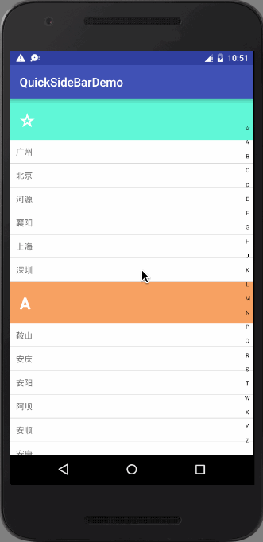

# 安卓开源框架鱼骨图

#Datas数据处理
##数据库
### Realm
#### Realm的git项目1
https://github.com/realm/realm-android-adapters
### Sugar
### Ormlite
### SQLBrite
### GreenDAO
### ActiveAndroid

#View视图
##RecyclerView
### BaseAdapter
### SuperAdapter
### CommonAdapter
### BGAAdapter-Adnroid
### LRecyclerView
### LRecyclerView
### UltimateRecyclerView
### BaseRecyclerViewAdapterHelpter

#Tool工具
##工具集
### Apache Commons
### Google Guava
### AndroidUtilCode
### android-common

##二维码
### Zxing
### barcodescanner
### BGAQRCode-Android
### zxing-android-embedded

#Event事件
##事件总线
### Otto
### EventBus
### HermesEventBus
### AndroidEventBus

#响应式编程
##响应框架
### Agera
### Rxjava
### RxBinding
### RxAndroid
### RxJavaJoins

#Network网络
##网络解析
##网络请求

#快速开发
##快速开发框架

#Multimedia多媒体camera audio video image
##多媒体
##图片缓存
##图片加载
##图片剪裁
##图片处理
##图片选择
##动画
##图表

#解耦降压
##调试框架
##依赖注入

#Log日志
##Log日志框架

#Test测试
##测试框架

#Performance性能
##性能优化
##后台处理

#热补丁

#逆向分析代码

#收藏
## AndroidResideMenu
[**仿QQ侧滑菜单(gradlew)**](https://github.com/SpecialCyCi/AndroidResideMenu)
最后提交日期:2015.11.05

---
## CircularFloatingActionMenu
[**扇形展开的悬浮菜单按钮(gradlew)**](https://github.com/oguzbilgener/CircularFloatingActionMenu)
最后提交日期:2015.01.31

---
## DividedDraggableView
[**分区域可拖动Item的类似GridView**](https://github.com/andyken/DividedDraggableView)
最后提交日期:2017.02.11
说明: 一个带有分割区域的可拖动 view ,可屏幕自动上下滚动进行 Item 移动交换

---
## FlowingDrawer
[** 带手势流动效果侧滑菜单**](https://github.com/mxn21/FlowingDrawer)
最后提交日期:2016.12.26
说明: 带手势流动效果侧滑菜单

---
## PickerView
[**仿iOS的PickerView控件**](https://github.com/Bigkoo/Android-PickerView)
最后提交日期:2018.04.14
说明: 仿 iOS 的 PickerView 控件，有时间，地点选择和选项选择并支持一二三级联动效果

---
## QuickSideBar
[**帮助快速查阅对应分组的侧边栏**](https://github.com/saiwu-bigkoo/Android-QuickSideBar)
最后提交日期:2017.04.19
说明: 帮助快速查阅对应分组的侧边栏(姓名，地址)

---
## RecyclerViewPager
[**垂直方向的 ViewPager，支持 Fragment**](https://github.com/lsjwzh/RecyclerViewPager)
最后提交日期:2018.03.21
说明: 完全继承自 RecyclerView，可以自定义触发翻页的距离，可自定义翻页速度，支持垂直方向的 ViewPager，支持 Fragment

---
## ScrollerCalendar
[**实现每行显示一年的 12 个月份的 RecyclerView 年历**](https://github.com/guanchao/ScrollerCalendar)
最后提交日期:2015.03.18
说明: 实现每行显示一年的 12 个月份的 RecyclerView 年历

---
## SlideAndDragListView
[**支持ListView的Item的拖动排序、左右滑动事件，可自定义左右滑动显示文字、图标、位移，同时支持onItemClick**](https://github.com/yydcdut/SlideAndDragListView)
最后提交日期:2018.04.24
说明: 支持ListView的Item的拖动排序、左右滑动事件，可自定义左右滑动显示文字、图标、位移，同时支持onItemClick，onItemLongClick等监听器，提供丰富的回调接口。

---
## ToggleButton
[**状态切换的 Button，类似 iOS，用 View 实现**](https://github.com/zcweng/SwitchButton)
最后提交日期:2016.12.23
说明: 状态切换的 Button，类似 iOS，用 View 实现

