# 安卓开源框架鱼骨图
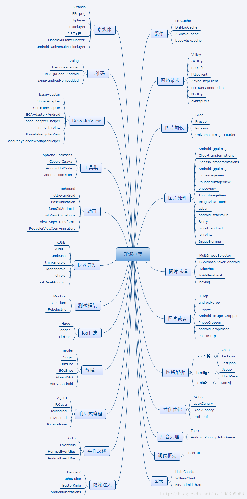


#逆向分析代码
[http://www.androiddevtools.cn/](http://www.androiddevtools.cn/)
##逆向工程


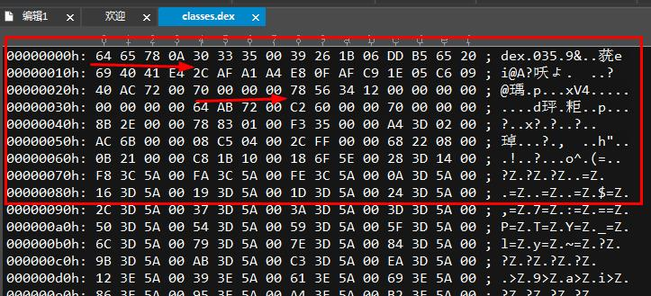
APKTOOL下载路径: [https://bitbucket.org/iBotPeaches/apktool/downloads/](https://bitbucket.org/iBotPeaches/apktool/downloads/)

adb shell tcpdump -p -vv -s 0 -w /sdcard/capture.pcap


Apk文件本质上其实是一个zip包。直接拿解压工具解压就可以看到其中包含了什么。下面简单介绍一下Apk文件的结构。
1. AndroidManifest.xml：应用的全局配置文件
1. assets文件夹：原始资源文件夹，对应着Android工程的assets文件夹，一般用于存放原始的网页、音频等等，与res文件夹的区别这里不再赘述，可以参考上面介绍的两篇文章。
1. classes.dex：源代码编译成class后，转成jar，再压缩成dex文件，dex是可以直接在Android虚拟机上运行的文件。
1. lib文件夹：引用的第三方sdk的so文件。
1. META-INF文件夹：Apk签名文件。
1. res文件夹：资源文件，包括了布局、图片等等。
1. resources.arsc：记录资源文件和资源id的映射关系。


### 逆向工程Git项目
https://github.com/pxb1988/dex2jar
https://github.com/google/android-classyshark
https://github.com/Juude/droidReverse
https://github.com/hammercui/android-reverse

###dex2jar的用法
[dex2jar](Android_RevertFile/dex2jar)
[jd-gui](Android_RevertFile/jd-gui)
命令:  d2j-dex2jar classes.dex

dex2jar
   作用：将apk反编译成Java源码（classes.dex转化成jar文件）

jd-gui
   作用：查看APK中classes.dex转化成出的jar文件，即源码文件

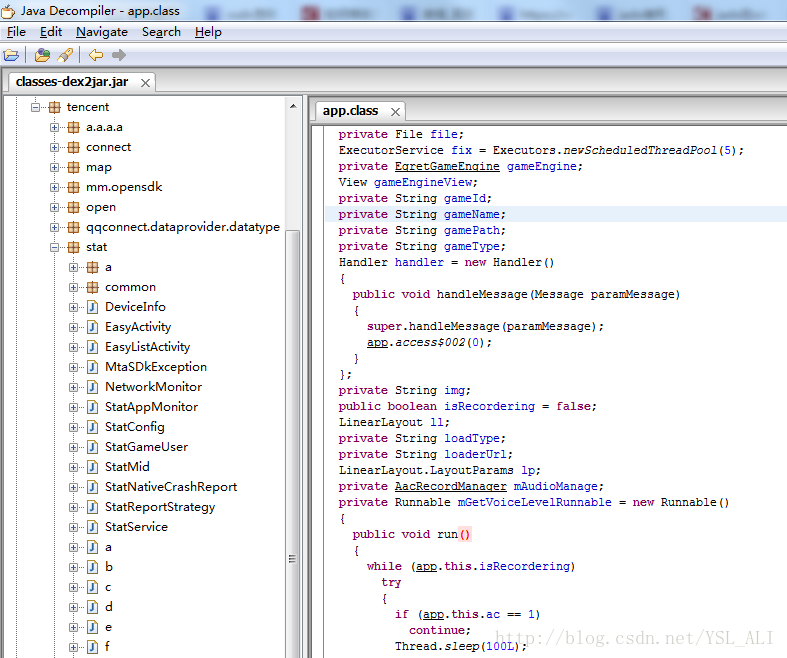
```
第一步：找到dex2jar和jd-gui两个文件

第二步：然后在把你需要反编译的apk包，后缀名改成zip，再解压，得到相应的解压文件

第三步：找到你解压后的文件里面的classes.dex文件，同时打开dex2jar-2.0文件夹，将classes.dex文件拷贝到dex2jar-2.0文件中

第四步：在dex2jar-2.0文件中shift+鼠标右键选择“在此处打开命令窗口（W）”，这样就进入到了dex2jar-2.0文件目录下，当然也可以自己通过cmd去指定dex2jar-2.0文件的路径，效果都是一样的

第五步：在此时的命令窗口中输入:d2j-dex2jar classes.dex 然后回车（注意：d2j-dex2jar和classes.dex之间在输入的时候有空格），执行完成后，会多出一个classes-dex2jar.jar文件，这个文件就是我们需要的

第六步：找到你下载的zip包解压后文件中的jd-gui文件夹，然后打开里面有jd-gui.exe文件,可以双击直接打开，然后，右上角 File —>Open File，将上面得到的classes-dex2jar.jar文件打开，就会得到我们最终想要的到的东西。
里面有别人引用的jar包，也有别人自定义项目工程的包，反正各种【代码资源】都在这了，【图片声音资源这里得不到的】，不过在第一次，你将apk后缀名改成zip解压后得到的解压文件里面就可以拿到别人的资源了
```

### enjarify 的使用 
把dex转换成jar已经有了比 dex2jar 更好的工具 enjarify
[地址: https://github.com/Storyyeller/enjarify](https://github.com/Storyyeller/enjarify)
使用命令 : python -O -m enjarify.main yourapp.apk    【paython需要为3以上版本】   生成 jar文件
```
python -O -m enjarify.main yourapp.apk

```

### ClassyShark 的使用
ClassyShark 作用:   能把 APK文件 解析出来并显示在UI上 【java 实现的UI上 】 并统计所有资源 方法数量 文件数量
命令:   
java ­jar ClassyShark.jar ­export b.apk   // 生成APK分析文件   method_counts.txt 【方法树形统计文本】  2.all_methods.txt  【所有方法名统计】  3.all_strings.txt 【所有字符串资源统计】
// 4. all_classes.txt  【所有类名的统计】    5.  AndroidManifest.xml_dump  【APK配置文件】
java -jar ClassyShark.jar -open 2.apk      // 解析APK 显示 smail文件  并统计数量
java -jar ClassyShark.jar -methodcounts b.apk    // 以字符串形式显示APK文件结构
java -jar ClassyShark.jar -inspect b.apk   // 分析APK中包含的方法数量 以及监听事件


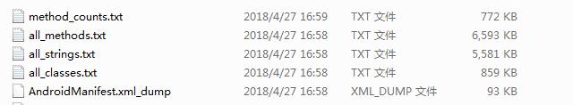
**java ­jar ClassyShark.jar ­export b.apk**


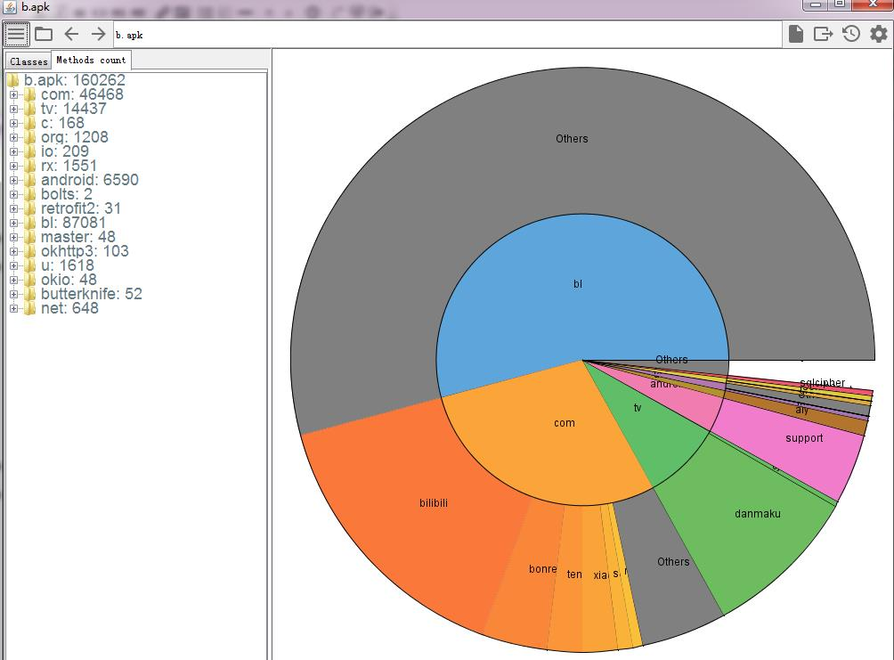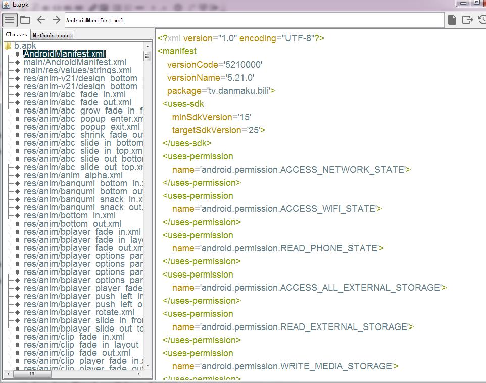
**java -jar ClassyShark.jar -open b.apk **


**java -jar ClassyShark.jar -methodcounts b.apk **
```
java -jar ClassyShark.jar -methodcounts b.apk 
Parsing classes.dex
Parsing classes2.dex
Parsing classes3.dex
Parsing classes4.dex
b.apk - 160262   【当前文件中包含的方法数量】
 ╠═com - 46468  【各个文档中包含的文件类方法数量】
 ║ ╠═googlecode - 1104
 ║ ║ ╚═mp4parser - 1104
 ║ ║    ╠═boxes - 536
 ║ ║    ║ ╠═mp4 - 228
 ║ ║    ║ ║ ╠═a - 126
 
```

java -jar ClassyShark.jar -inspect b.apk   // 分析APK中包含的方法数量 以及监听事件
```
D:\gitrank\逆向\android-classyshark-master>java -jar ClassyShark.jar -inspect b.apk
Picked up _JAVA_OPTIONS: -Xmx512M

                  ~ APK DASHBOARD ~

+-------------------+------------------------------------------------------------------------------------------------------------------------------------+
| Recommendation    | Description                                                                                                                        |
+-------------------+------------------------------------------------------------------------------------------------------------------------------------+
|                   |                                                                                                                                    |
| classes.dex       | 65324 methods                                                                                                                      |
| classes2.dex      | 65236 methods                                                                                                                      |
| classes3.dex      | 65123 methods                                                                                                                      |
| classes4.dex      | 21262 methods                                                                                                                      |
|                   |                                                                                                                                    |
|                   |                                                                                                                                    |
| System Broadcast  | android.intent.action.DOWNLOAD_COMPLETE ==> com.bilibili.ad.adview.web.apkdownload.ApkMgr$ApkDownloadReceiver                      |
| System Broadcast  | android.intent.action.MEDIA_BUTTON ==> tv.danmaku.biliplayer.features.headset.HeadsetControlPlayAdapter$HeadsetMediaButtonReceiver |
| System Broadcast  | android.net.conn.CONNECTIVITY_CHANGE ==> com.xiaomi.push.service.receivers.NetworkStatusReceiver                                   |
|                   |                                                                                                                                    |
+-------------------+------------------------------------------------------------------------------------------------------------------------------------+

```
### Baksmali 的使用
[Baksmali/Smail 下载地址: https://bitbucket.org/JesusFreke/smali/downloads/](https://bitbucket.org/JesusFreke/smali/downloads/)
[Smail](Android_RevertFile/baksmali-2.2.2.jar)
[Baksmali](Android_RevertFile/baksmali-2.2.2.jar)

作用:  这2个jar包的作用就是将dex文件与smali文件格式进行互相转换。  要使用jar，首先需要配置Java环境

Baksmali 使用命令:  把 dex文件 转为 smail 文件内容
java -jar baksmali-2.2.2.jar d  dex文件 【 classes.dex 】    // dex文件为apk解压缩后的文件
java -jar baksmali-2.2.2.jar d classes.dex  


Smail使用命令:  把  smail 文件内容 转为 dex文件  
java -jar smali-2.2.2.jar a out   // 其中out 为 smail根文件夹    命令会生成 out.dex 文件夹


### apktool 的 使用
作用: 主要查看res文件下xml文件、AndroidManifest.xml和图片。（注意：如果直接解压.apk文件，xml文件打开全部是乱码）
[apktool](Android_RevertFile/apktool)
[下载地址： https://ibotpeaches.github.io/Apktool/install/](https://ibotpeaches.github.io/Apktool/install/)
下载文件：  apktool.bat       apktool_2.3.3.jar
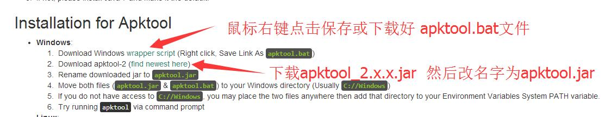
命令:  apktool d app.apk    【 java -jar apktool.jar d yourApkFile.apk 】
```
使用方法:
1. 将下载的 apktool_2.3.3.jar  名字改为  apktool.jar
2. 运行CMD，把 app.apk放到所在目录，然后运行apktool d app.apk 【apk文件名字】就可以了，默认解压的文件就在app-release.apk所在目录。
  例如 [ apktool d bibibi.apk ]


java -jar apktool.jar d yourApkFile.apk
// 注意`apktool.jar`是刚才下载后的jar的名称，`d`参数表示decode
// 在这个命令后面还可以添加像`-o -s`之类的参数，例如
// java -jar apktool.jar d yourApkFile.apk -o destiantionDir -s
// 几个主要的参数设置方法及其含义：
-f 如果目标文件夹已存在，强制删除现有文件夹
-o 指定反编译的目标文件夹的名称（默认会将文件输出到以Apk文件名命名的文件夹中）
-s 保留classes.dex文件（默认会将dex文件解码成smali文件）
-r 保留resources.arsc文件（默认会将resources.arsc解码成具体的资源文件）
```


### Smali2JavaUI 的使用 
作用 :  直接把  classes.dex --> classes.jar ---> classes（包含java文件）
Smali2JavaUI 能直接完成这个操作     dex2jar不能直接完成 转为java文件的操作
[Smali2Java](Android_RevertFile/Smali2Java)
```
smali2java是一个将smali代码反编译成java代码的工具。
什么是smali？smali是将Android字节码用可阅读的字符串形式表现出来的一种语言，可以称之为Android字节码的反汇编语言。使用apktool可以将Android应用程序包（apk或jar）反编译为smali代码。

smali2java工具基于apktool v1.5.0（baksmali v1.3.4）生成的smali文件，依赖于smali文件中的代码行数（.line关键字）和变量别名（.local关键字）等信息，
可以最大程度还原原始的java代码。还原出的java代码将具有原始的变量命名，代码的顺序也与原始的java代码保持一致。因此，本工具也具有局限性，
仅适用于带有行数和变量别名信息的smali文件（java编译器的编译选项可以在生成的字节码中剔除这些信息）


对于先dex2jar把classes.dex转为jar，再jd-gui把jar转为源码*.java文件。
现在可以用Smali2JavaUI这个软件，一部到位。可以把这两个步骤化为一个步骤。
所以，如果只想反编译看*.java文件的话，只用Smali2JavaUI软件就可以了。
这个软件可以直接打开***.apk文件，然后就直接看到*.java文件了。
```


#Annotation注解框架
##依赖注入框架
### butterknife 的使用
说明: ButterKnife 是控件注入框架，可以帮助安卓开发者省去初始化控件的重复性工作，简单快捷地初始化布局文件中的控件，极大地提升开发效率
1. 导入项目方法 （导入ButterKnife至项目中）
       1. 在工程的build.gradle中导入butterknife插件 
   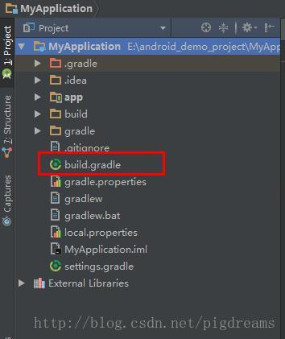
            ```
            buildscript {
            repositories {
            jcenter()
            }
            dependencies {
           
            //加入下面这段代码
            classpath 'com.android.tools.build:gradle:3.0.1'   // 使用 Gradle 3.0.1 版本
            classpath 'com.jakewharton:butterknife-gradle-plugin:8.5.1'   // ▲步骤一: 在根目录的 build.gradlew 文件中加入 butterknife的依赖
            }
            }
            
            allprojects {
            repositories {
            jcenter()
            }
            }
            ```
       1. 在app中的builde.gradle 中添加butterknife的插件
          ```
            apply plugin: 'com.android.application'
            apply plugin: 'com.jakewharton.butterknife'  //  ▲步骤二: 在APP目录的 build.gradlew 文件中加入 butterknife的plugin
            
            
            dependencies {

            implementation 'com.jakewharton:butterknife:8.5.1'  //  ▲步骤三: 在APP目录的 build.gradlew 文件中加入 butterknife的编译依赖  //加入下面这两行代码
            annotationProcessor 'com.jakewharton:butterknife-compiler:8.5.1'
            
            }
          ```
       1. 在工程的build.gradle中导入butterknife插件 
1. 简单使用butterknife初始化控件 
    1. 创建一个android工程，布局如下 
   
       ```  activity_main.xml
                <?xml version="1.0" encoding="utf-8"?>
                
                <LinearLayout xmlns:android="http://schemas.android.com/apk/res/android"
                android:layout_width="match_parent"
                android:layout_height="match_parent"
                android:orientation="vertical"
                android:padding="8dp">
                
                <TextView
                android:id="@+id/title"
                android:layout_width="match_parent"
                android:layout_height="wrap_content"
                android:gravity="center"
                android:text="text1"
                android:textSize="50sp" />
                
                <TextView
                android:id="@+id/subtitle"
                android:layout_width="match_parent"
                android:layout_height="wrap_content"
                android:gravity="center"
                android:text="subText"
                android:textSize="20sp" />
                
                <Button
                android:id="@+id/btn1"
                android:layout_width="match_parent"
                android:layout_height="0dp"
                android:layout_margin="10dp"
                android:layout_weight="1"
                android:background="@android:color/holo_green_light" />
                <ListView
                android:id="@+id/list1"
                android:layout_width="match_parent"
                android:layout_height="0dp"
                android:layout_weight="1"
                android:layout_margin="10dp"
                />
                
                <TextView
                android:id="@+id/footer"
                android:layout_width="match_parent"
                android:layout_height="wrap_content"
                android:gravity="center"
                android:text="footter"
                android:textSize="17sp"
                android:textStyle="italic" />
                </LinearLayout>

       ```
    1. 在activity中的oncreate()方法里初始化butterknife框架  注意初始化要放在setView()之后    【import butterknife.ButterKnife;】
    ```
        import butterknife.ButterKnife;
        
        public class MainActivity extends AppCompatActivity {
        
        @Override
        protected void onCreate(Bundle savedInstanceState) {
            super.onCreate(savedInstanceState);
            setContentView(R.layout.activity_main);
            ButterKnife.bind(this);  //   ▲步骤四: 在Activity的 onCreate方法中初始化框架  ButterKnife    Alt+Enter 自动导入包
        }
        }
    ```
   1.   @BindView(R.id.title)  使用注解绑定 视图控件   【import butterknife.BindView;】
     ```
        import butterknife.BindView;
        import butterknife.ButterKnife;
        public class MainActivity extends AppCompatActivity {
            //@BindView绑定控件，省去了写findviewbyid的重复性操作
            @BindView(R.id.title)
             TextView titleText;
        
            @BindView(R.id.sub_title)
             TextView subTitleText;
        
            @BindView(R.id.footer)
             TextView footerText;
        
            @BindView(R.id.list1)
             ListView listView;
        
            @BindView(R.id.btn1)
             Button btn1;
        
            @Override
            protected void onCreate(Bundle savedInstanceState) {
                super.onCreate(savedInstanceState);
                setContentView(R.layout.activity_main);
                ButterKnife.bind(this);
            }
        }
     ```
   1.   测试控件是否被正确初始化
     ```
         protected void onCreate(Bundle savedInstanceState) {
        super.onCreate(savedInstanceState);
        setContentView(R.layout.activity_main);
        ButterKnife.bind(this);


        titleText.setText("头");  // 用于测试控件  是否正确 初始化
        footerText.setText("脚");
    }
     
     ```
     
   1.   给按钮Button通过注解方式添加 onclick事件   【import butterknife.OnClick;】
      ```
      import butterknife.OnClick;
      
    int num = 0;
    @OnClick(R.id.btn1)
    public void onclick(View view){
        titleText.setText("头"+num);
        footerText.setText("脚"+num);
        subTitleText.setText("脚"+num);
        num++;
    }
      
      ```
   1.   在代码中绑定 res文件中的资源对象
   绑定注解
   @BindString (R.string.open)
   @BindDrawable (R.drawable.open)
   @BindColor  (R.color.red)
   @BindDimen  (R.dimen.dimen1)
   @BindView   (R.id.tv_fm1)  
   @BindViews({ R.id.btn1,R.id.btn2 }) List<Button> buttons;
   @BindArray(R.array.open_close )    String[] open_close ;   int[] values;
   @BindBitmap(R.mipmap.wifi )  Bitmap bitmap;  // 【mipmap文件夹下的图片资源  纹理化】
   @BindBool(R.bool.true )  boolean flag;  // ---->绑定boolean值
   @BindInt (R.integer.value250) int value ;
   
绑定事件
@OnClick---->点击事件
@OnCheckedChanged ---->选中，取消选中
@OnEditorAction ---->软键盘的功能键
@OnFocusChange ---->焦点改变
@OnItemClick item---->被点击(注意这里有坑，如果item里面有Button等这些有点击的控件事件的，需要设置这些控件属性focusable为false)
@OnItemLongClick item---->长按(返回真可以拦截onItemClick)
@OnItemSelected ---->item被选择事件
@OnLongClick ---->长按事件
@OnPageChange ---->页面改变事件
@OnTextChanged ---->EditText里面的文本变化事件
@OnTouch ---->触摸事件

```
      
arrays.xml   【数组集合xml配置文件】    【 R.array.resolver_target_actions_unpin 代码引用 】
      <?xml version="1.0" encoding="utf-8"?>
      <resources xmlns:xliff="urn:oasis:names:tc:xliff:document:1.2">
      
      
      
    <integer-array name="reminder_methods_values" translatable="false">  // 【整型数组】
        <item>1</item>  <!-- METHOD_ALERT -->
        <item>2</item>  <!-- METHOD_EMAIL -->
        <item>3</item>  <!-- METHOD_SMS -->
        <item>4</item>  <!-- METHOD_ALARM -->
    </integer-array>
    
    
    <string-array name="open_close">     //【字符串的数组】
        <item>@string/open</item>
        <item>@string/close</item>
    </string-array>

    <string-array translatable="false" name="special_locale_codes">   //【字符串的数组】
        <item>ar_EG</item>
        <item>zh_CN</item>
        <item>zh_TW</item>
    </string-array>
    
    
   <array name="preloaded_freeform_multi_window_drawables">    //【 drawable 数组】
      <item>@drawable/decor_maximize_button_dark</item>
      <item>@drawable/decor_maximize_button_light</item>
   </array>
   
   
       <array name="preloaded_color_state_lists">   //【 Color 数组】
        <item>@color/primary_text_dark</item>
        <item>@color/primary_text_dark_disable_only</item>
       </array>
      </resources>
      
====================================================

bools.xml   【布尔值xml配置文件】   R.bool.true

<?xml version="1.0" encoding="utf-8"?>
<resources>
    <bool name="kg_enable_camera_default_widget">true</bool>
    <bool name="kg_center_small_widgets_vertically">false</bool>
    <bool name="kg_top_align_page_shrink_on_bouncer_visible">true</bool>
    <bool name="action_bar_embed_tabs">true</bool>
    <bool name="split_action_bar_is_narrow">true</bool>
    <bool name="preferences_prefer_dual_pane">false</bool>
    <bool name="show_ongoing_ime_switcher">true</bool>
    <bool name="action_bar_expanded_action_views_exclusive">true</bool>
    <bool name="target_honeycomb_needs_options_menu">true</bool>
    <bool name="use_lock_pattern_drawable">false</bool>
    <bool name="true">true</bool>
    <bool name="false">false</bool>
</resources>
====================================================
colors.xml  【颜色配置xml文件】  R.color.floating_popup_divider_dark    R.drawable.screen_background_light
<resources>
    <drawable name="screen_background_light">#ffffffff</drawable>
    <drawable name="screen_background_dark">#ff000000</drawable>
    <color name="tooltip_background_dark">#e6616161</color>
    <color name="tooltip_background_light">#e6FFFFFF</color>
    <color name="floating_popup_divider_dark">#2F2F2F</color>
    <color name="floating_popup_divider_light">#E9E9E9</color>
</resources>

====================================================
integers.xml    【整数配置xml文件】   R.integer.integer250

<?xml version="1.0" encoding="utf-8"?>
<resources>
    <integer name="kg_carousel_angle">75</integer>
    <integer name="kg_glowpad_rotation_offset">0</integer>
    <integer name="button_pressed_animation_duration">100</integer>
    <integer name="button_pressed_animation_delay">100</integer>
    <integer name="disabled_alpha_animation_duration">100</integer>
    <integer name="dock_enter_exit_duration">250</integer>

    <integer name="date_picker_mode">1</integer>
    <integer name="time_picker_mode">1</integer>

    <!-- Specifies date picker mode to be 'calendar' -->
    <integer name="date_picker_mode_material">2</integer>

    <!-- Specifies time picker mode to be 'clock' -->
    <integer name="time_picker_mode_material">2</integer>

    <integer name="date_picker_header_max_lines_material">2</integer>
     <integer name="integer250">250</integer>
</resources>


====================================================
dimens.xml  【布局尺寸xml文件】   @dimen/dimen1  【在其他xml文件中被引用】   R.dimen.dimen1  代码引用
        <resources>
        <dimen name="action_button_min_width">56dp</dimen>
        <dimen name="indeterminate_progress_size">32dp</dimen>
        <dimen name="dimen1">250dp</dimen>
        </resources>


```


### butterknife 布局控件大全

#Datas数据处理
##数据库
### Realm
#### Realm的git项目1
https://blog.csdn.net/chenli_001/article/details/77895396
https://github.com/RaphetS/DemoRealm

移动界面原型设计工具 GUI

### Sugar
### Ormlite
### SQLBrite
### GreenDAO
### ActiveAndroid


#View视图
##RecyclerView
### BaseAdapter
### SuperAdapter
### CommonAdapter
### BGAAdapter-Adnroid
### LRecyclerView
### LRecyclerView
### UltimateRecyclerView
### BaseRecyclerViewAdapterHelpter


#Tool工具
##工具集
### Apache Commons
### Google Guava
### AndroidUtilCode
### android-common

##二维码
### Zxing
### barcodescanner
### BGAQRCode-Android
### zxing-android-embedded


#Event事件
##事件总线
### Otto
### EventBus
### HermesEventBus
### AndroidEventBus


#响应式编程
##响应框架
### Agera
### Rxjava
### RxBinding
### RxAndroid
### RxJavaJoins


#Network网络
##网络解析
##网络请求


#快速开发
##快速开发框架


#Multimedia多媒体camera audio video image
##多媒体
##图片缓存
##图片加载
##图片剪裁
##图片处理
##图片选择
##动画
##图表


#解耦降压
##调试框架
##依赖注入


#Log日志
##Log日志框架

#Test测试
##测试框架


#Performance性能
##性能优化
##后台处理


#热补丁


#收藏
## AndroidResideMenu
[**仿QQ侧滑菜单(gradlew)**](https://github.com/SpecialCyCi/AndroidResideMenu)
最后提交日期:2015.11.05
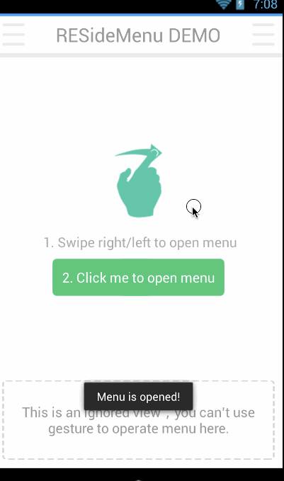


---
## CircularFloatingActionMenu
[**扇形展开的悬浮菜单按钮(gradlew)**](https://github.com/oguzbilgener/CircularFloatingActionMenu)
最后提交日期:2015.01.31


---
## DividedDraggableView
[**分区域可拖动Item的类似GridView**](https://github.com/andyken/DividedDraggableView)
最后提交日期:2017.02.11
说明: 一个带有分割区域的可拖动 view ,可屏幕自动上下滚动进行 Item 移动交换
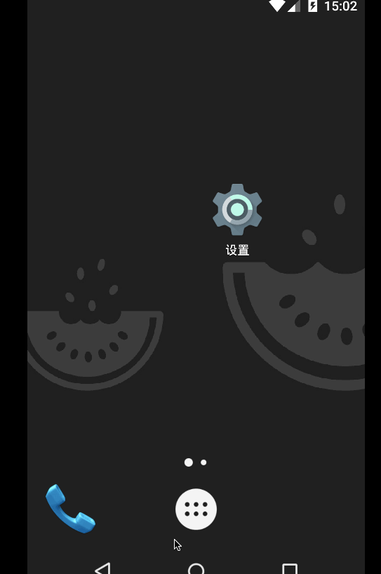


---
## FlowingDrawer
[** 带手势流动效果侧滑菜单**](https://github.com/mxn21/FlowingDrawer)
最后提交日期:2016.12.26
说明: 带手势流动效果侧滑菜单


---
## PickerView
[**仿iOS的PickerView控件**](https://github.com/Bigkoo/Android-PickerView)
最后提交日期:2018.04.14
说明: 仿 iOS 的 PickerView 控件，有时间，地点选择和选项选择并支持一二三级联动效果


---
## QuickSideBar
[**帮助快速查阅对应分组的侧边栏**](https://github.com/saiwu-bigkoo/Android-QuickSideBar)
最后提交日期:2017.04.19
说明: 帮助快速查阅对应分组的侧边栏(姓名，地址)


---
## RecyclerViewPager
[**垂直方向的 ViewPager，支持 Fragment**](https://github.com/lsjwzh/RecyclerViewPager)
最后提交日期:2018.03.21
说明: 完全继承自 RecyclerView，可以自定义触发翻页的距离，可自定义翻页速度，支持垂直方向的 ViewPager，支持 Fragment


---
## ScrollerCalendar
[**实现每行显示一年的 12 个月份的 RecyclerView 年历**](https://github.com/guanchao/ScrollerCalendar)
最后提交日期:2015.03.18
说明: 实现每行显示一年的 12 个月份的 RecyclerView 年历


---
## SlideAndDragListView
[**支持ListView的Item的拖动排序、左右滑动事件，可自定义左右滑动显示文字、图标、位移，同时支持onItemClick**](https://github.com/yydcdut/SlideAndDragListView)
最后提交日期:2018.04.24
说明: 支持ListView的Item的拖动排序、左右滑动事件，可自定义左右滑动显示文字、图标、位移，同时支持onItemClick，onItemLongClick等监听器，提供丰富的回调接口。
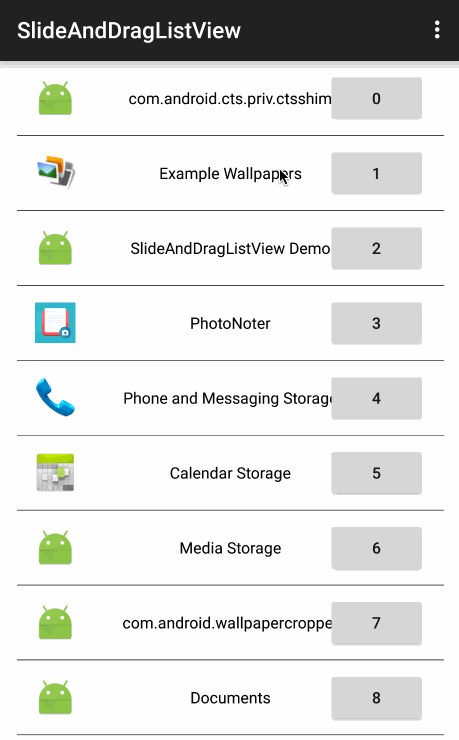


---
## ToggleButton
[**状态切换的 Button，类似 iOS，用 View 实现**](https://github.com/zcweng/SwitchButton)
最后提交日期:2016.12.23
说明: 状态切换的 Button，类似 iOS，用 View 实现


